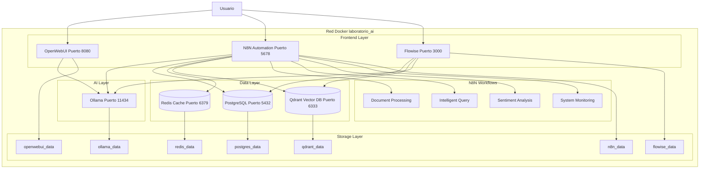
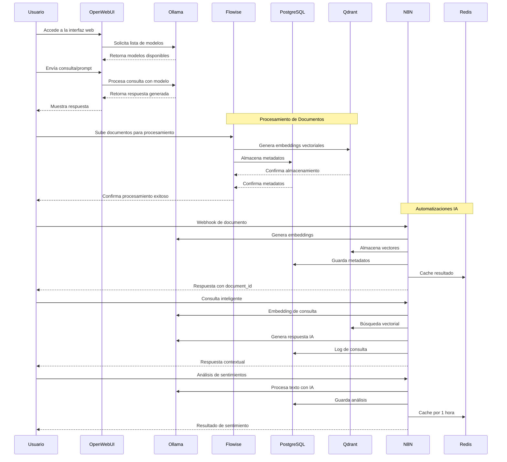
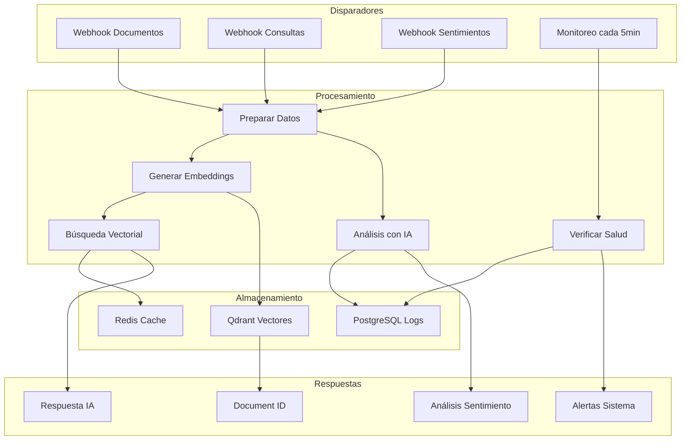
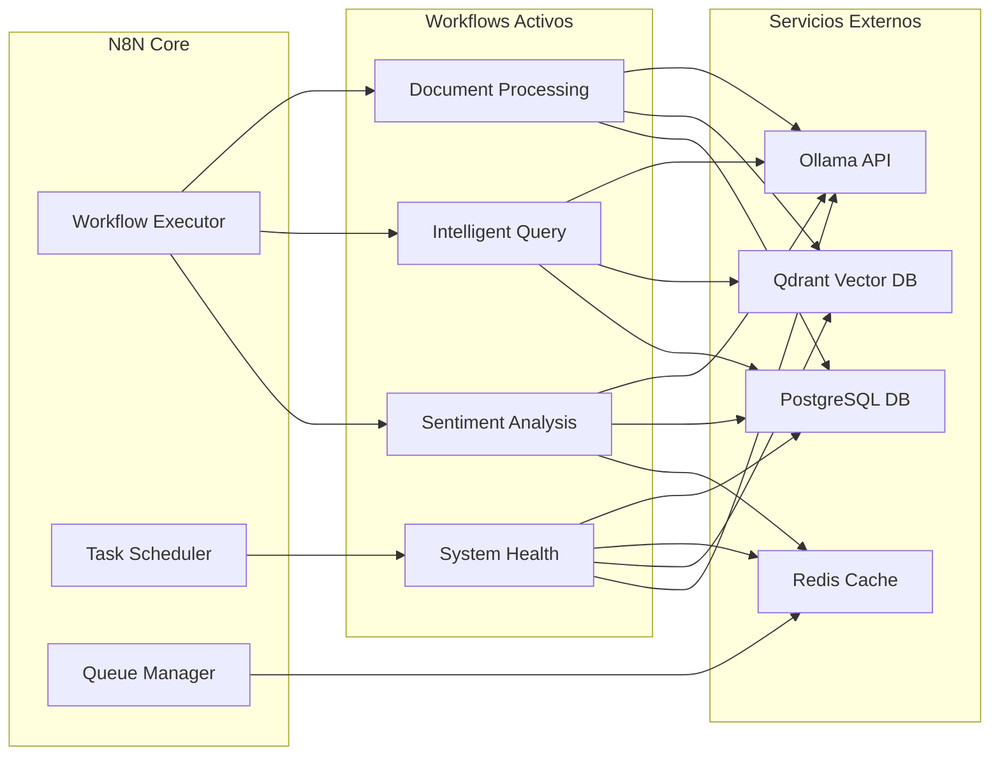
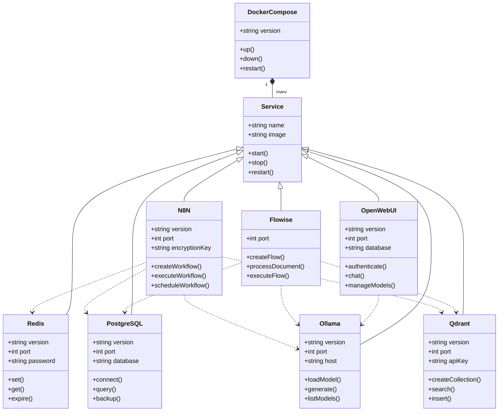
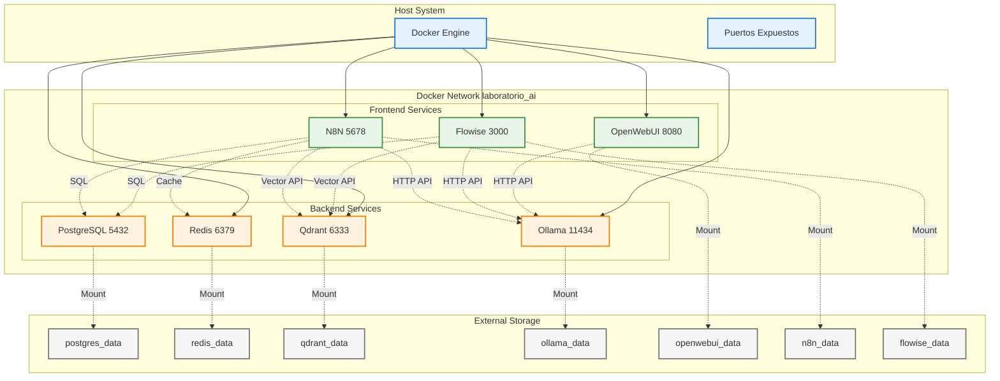

# Laboratorio AI Local

[](https://github.com/EdissonGirald0/laboratorioAI/actions/workflows/main.yml)
[](LICENSE)

## 📋 Índice

- [🛠️ Stack Tecnológico](#stack-tecnológico)
- [📋 Descripción del Proyecto](#descripción-del-proyecto)
- [🎯 Características Principales](#características-principales)
- [🏗️ Arquitectura del Sistema](#arquitectura-del-sistema)
- [🌐 Servicios Principales](#servicios-principales)
- [🔐 Seguridad y Credenciales](#seguridad-y-credenciales)
- [🚀 Configuración e Instalación](#configuración-e-instalación)
- [📊 Verificación de Servicios](#verificación-de-servicios)
- [🔧 Scripts de Mantenimiento](#scripts-de-mantenimiento)
- [🤖 Workflows N8N Disponibles](#workflows-n8n-disponibles)
- [🔍 Administración y Monitoreo](#administración-y-monitoreo)
- [🧠 Modelos IA y Configuración](#modelos-ia-y-configuración)
- [🎨 Ejemplos de Uso Avanzado](#ejemplos-de-uso-avanzado)
- [🐛 Solución de Problemas](#solución-de-problemas)
- [🤝 Contribuciones](#contribuciones)
- [📝 Licencia](#licencia)

## 🛠️ Stack Tecnológico

[](https://www.docker.com/)
[](https://www.postgresql.org/)
[](https://redis.io/)
[](https://qdrant.tech/)
[](https://ollama.ai/)
[](https://n8n.io/)
[](https://flowiseai.com/)
[](https://github.com/open-webui/open-webui)

## 📋 Descripción del Proyecto

**Laboratorio AI Local** es una plataforma completa de Inteligencia Artificial que se ejecuta localmente usando Docker. Proporciona un ecosistema integrado para experimentar con modelos de IA, automatizaciones, procesamiento de documentos y análisis de datos.

### 🎯 Características Principales

- **🔒 Totalmente Local**: Sin dependencias externas de APIs
- **🐳 Dockerizado**: Configuración reproducible y aislada
- **🚀 Listo para Usar**: Scripts de inicialización automática
- **📊 Base de Datos Completa**: PostgreSQL para persistencia
- **⚡ Cache Inteligente**: Redis para rendimiento optimizado
- **🧠 IA Integrada**: Ollama + OpenWebUI para modelos locales
- **🔄 Automatizaciones**: N8N con workflows preconfigurados
- **🎨 Constructor Visual**: Flowise para flujos de IA sin código

## 🏗️ Arquitectura del Sistema

### 🌐 Servicios Principales

| Servicio | Puerto | Descripción | Estado |
|----------|--------|-------------|---------|
| **N8N** | 5678 | Automatizaciones y workflows de IA | ✅ v1.104.1 |
| **Flowise** | 3000 | Constructor visual de flujos IA | ✅ v2.1.1 |
| **OpenWebUI** | 8080 | Interfaz web para modelos IA | ✅ v0.6.13 |
| **Ollama** | 11434 | Servidor de modelos IA locales | ✅ Latest |
| **Qdrant** | 6333 | Base de datos vectorial | ✅ Latest |
| **PostgreSQL** | 5432 | Base de datos relacional | ✅ v16-alpine |
| **Redis** | 6379 | Cache y colas de trabajo | ✅ v7-alpine |

### 🗂️ Estructura de Directorios

### 🏥 Monitoreo y Alertas Automáticas
- **Verificación continua** de salud del sistema
- **Alertas inteligentes** por fallos o degradación
- **Dashboard en tiempo real** de métricas
- **Logs estructurados** para análisis

## 🏗️ Arquitectura del Sistema



## 📊 Diagrama de Secuencia - Flujo de Interacción



## 🔄 Flujo de Automatizaciones N8N



## 🔗 Integración de Servicios N8N



## 🎯 Casos de Uso del Sistema


## 🔧 Diagrama de Componentes



## 🔄 Flujo de Configuración e Inicialización


## 🌐 Diagrama de Red y Comunicación



### 🚀 Características Principales

- **Entorno Aislado**: Todos los servicios se ejecutan en contenedores Docker
- **Fácil Configuración**: Scripts automatizados para la configuración inicial
- **Backup Automático**: Sistema de respaldo para datos y configuraciones
- **Seguridad**: Configuración segura por defecto
- **Escalabilidad**: Fácil de extender con nuevos servicios

### 🛠️ Tecnologías Utilizadas

- Docker y Docker Compose
- PostgreSQL para almacenamiento de datos
- Qdrant para búsqueda vectorial
- Ollama para modelos de lenguaje local
- N8N para automatización
- Flowise para procesamiento de datos
- OpenWebUI para interfaz web

### 📦 Estructura del Repositorio

```
laboratorioAI/
├── .github/                    # Configuración de GitHub Actions
├── scripts/                    # Scripts de mantenimiento
├── postgres/                   # Configuración de PostgreSQL
├── qdrant/                     # Configuración de Qdrant
├── ollama/                     # Configuración de Ollama
├── n8n/                        # Configuración de N8N
├── flowise/                   # Configuración de Flowise
├── openwebui/                  # Configuración de OpenWebUI
├── docker-compose.yml          # Configuración de Docker Compose
├── .gitignore                  # Archivos ignorados por Git
├── LICENSE                     # Licencia del proyecto
└── README.md                   # Este archivo
```

## Requisitos Previos

- Docker y Docker Compose
- Git
- Sistema operativo Linux (recomendado Ubuntu 22.04 o superior)
- Mínimo 16GB de RAM
- 50GB de espacio en disco
- GPU compatible con CUDA (opcional, pero recomendado)

## Estructura del Proyecto

```
.
├── README.md                 # Documentación del proyecto
├── docker-compose.yml        # Configuración de servicios Docker
├── .gitignore               # Archivos ignorados por Git
├── LICENSE                  # Licencia del proyecto
├── scripts/                 # Scripts de mantenimiento y configuración
│   ├── init-env.sh         # Generación de variables de entorno
│   ├── init-data.sh        # Inicialización de bases de datos
│   ├── backup-data.sh      # Backup de datos y configuración
│   └── restore-data.sh     # Restauración desde backups
├── backups/                # Directorio de respaldos
├── postgres/              # Datos de PostgreSQL
│   └── data/
├── qdrant/               # Datos de Qdrant
│   └── data/
├── ollama/              # Datos de Ollama
│   └── data/
```
laboratorioAI/
├── docker-compose.yml   # Configuración principal de servicios
├── .env                 # Variables de entorno (auto-generado)
├── .gitignore          # Archivos excluidos del control de versiones
├── scripts/            # Scripts de automatización y mantenimiento
│   ├── init-env.sh     # Generación automática de credenciales
│   ├── init-db.sh      # Inicialización de base de datos
│   ├── backup-data.sh  # Respaldo de datos
│   ├── test-lab.sh     # Pruebas de conectividad
│   └── reset-env.sh    # Reinicio completo del entorno
├── postgres/           # Configuración PostgreSQL
│   ├── data/          # Datos persistentes (auto-generado)
│   └── init-scripts/  # Scripts de inicialización
├── n8n/               # Configuración N8N
│   ├── data/          # Datos persistentes
│   ├── workflows/     # Workflows preconfigurados en español
│   └── credentials/   # Credenciales de servicios
├── flowise/           # Datos Flowise
│   └── data/          # Base de datos y configuración
├── openwebui/         # Datos OpenWebUI
│   └── data/          # Configuración y chat history
├── ollama/            # Modelos y datos Ollama
│   └── data/          # Modelos descargados
├── qdrant/            # Base de datos vectorial
│   └── data/          # Colecciones y vectores
└── redis/             # Cache y colas
    └── data/          # Datos persistentes
```

## � Gestión de Credenciales y Seguridad

### 🔑 Generación Automática de Credenciales

**🚨 IMPORTANTE**: Este proyecto genera automáticamente todas las credenciales usando métodos criptográficamente seguros. **NUNCA** uses credenciales por defecto en producción.

#### 🛠️ Script de Inicialización Segura

```bash
# Ejecutar para generar credenciales únicas
./scripts/init-env.sh
```

**Qué genera este script:**
- ✅ Contraseñas de 16 caracteres aleatorios para PostgreSQL
- ✅ Claves de encriptación de 32 bytes para N8N
- ✅ API Keys seguros para Qdrant
- ✅ Secret Keys para aplicaciones web
- ✅ Contraseñas para Redis con caracteres alfanuméricos

#### 🔒 Métodos de Seguridad Implementados

| Componente | Método de Generación | Longitud | Algoritmo |
|------------|---------------------|----------|-----------|
| **PostgreSQL** | `openssl rand -base64` | 16 chars | Base64 + filtrado |
| **N8N Encryption** | `openssl rand -base64` | 32 bytes | Base64 puro |
| **Redis Password** | `openssl rand + tr filter` | 16 chars | Alfanumérico |
| **Qdrant API Key** | `openssl rand + tr filter` | 32 chars | Alfanumérico |
| **WebUI Secret** | `openssl rand -base64` | 32 bytes | Base64 puro |

### 📋 Configuración de Servicios

#### 🗃️ PostgreSQL (Base de Datos Principal)
```properties
# Configuración automática en .env
Host: postgres (interno) / localhost (externo)
Puerto: 5432
Base de Datos: ailab
Usuario Admin: postgres (auto-generado)
Usuario Apps: aiadmin (auto-generado)
Conexión: Autenticación scram-sha-256
```

#### 🚀 N8N (Automatización)
```properties
# Acceso y configuración
URL: http://localhost:5678
Autenticación: Deshabilitada (desarrollo local)
Base de Datos: PostgreSQL (usuario aiadmin)
Encriptación: AES-256 con clave auto-generada
Queue: Redis para tareas en background
```

#### 🎨 Flowise (Constructor Visual IA)
```properties
# Acceso seguro
URL: http://localhost:3000
Usuario: admin
Contraseña: Auto-generada (16 caracteres)
Base de Datos: PostgreSQL (usuario postgres)
Tipo: flowiseai/flowise:2.1.1 (oficial)
```

#### ⚡ Redis (Cache y Colas)
```properties
# Configuración de rendimiento
Host: redis / localhost
Puerto: 6379
Autenticación: Contraseña requerida (auto-generada)
Persistencia: AOF habilitada
Uso: Cache N8N + Queue jobs
```

#### 🧠 Qdrant (Base de Datos Vectorial)
```properties
# Almacenamiento de embeddings
URL: http://localhost:6333
API Key: Requerido (32 caracteres auto-generados)
Puerto gRPC: 6334
Colecciones: Auto-creadas por workflows
```

#### 🤖 Ollama (Modelos IA Locales)
```properties
# Servidor de modelos
URL: http://localhost:11434
Autenticación: No requerida (local)
Modelos: Descarga automática según necesidad
API: Compatible con OpenAI
```

#### 🌐 OpenWebUI (Interfaz Web)
```properties
# Chat interface
URL: http://localhost:8080
Base de Datos: SQLite integrada
Autenticación: Registro local opcional
Integración: Ollama backend automático
```

### � Verificación de Credenciales

## Scripts de Mantenimiento

```bash
# Verificación de servicios - Usar estos comandos para verificar el estado
docker-compose ps                    # Estado de todos los servicios
docker logs laboratorioai-n8n-1    # Logs específicos de N8N
docker logs laboratorioai-flowise-1 # Logs específicos de Flowise

# Verificar conexión PostgreSQL
docker exec -it laboratorioai-postgres-1 psql -U postgres -d ailab -c "SELECT version();"

# Test de credenciales N8N
curl -f http://localhost:5678/healthz

# Test de credenciales Flowise  
curl -f http://localhost:3000/api/v1/ping

# Verificar base de datos Qdrant
curl -f http://localhost:6333/health

# Regenerar credenciales (solo si es necesario por seguridad)
bash scripts/init-env.sh  # Genera nuevas credenciales seguras
docker-compose down && docker-compose up -d
```

## 🚀 Configuración e Instalación

### Requisitos Previos
- **Docker** y **Docker Compose** instalados
- **Git** para clonar el repositorio  
- **Linux** (Ubuntu 22.04+ recomendado)
- **16GB RAM** mínimo recomendado
- **50GB** espacio en disco
- **GPU CUDA** (opcional para rendimiento)

### 📝 Pasos de Instalación (Orden Obligatorio)

#### 1. Clonar y Preparar
```bash
git clone https://github.com/EdissonGirald0/laboratorioAI.git
cd laboratorioAI
```

#### 2. **🔑 CRÍTICO - Generar Credenciales**
```bash
chmod +x scripts/init-env.sh
./scripts/init-env.sh
```
**⚠️ IMPORTANTE**: Este paso es OBLIGATORIO antes de `docker-compose up`

#### 3. Iniciar Servicios
```bash
docker-compose up -d
```

#### 4. Verificar Estado
```bash
# Verificar todos los servicios
docker-compose ps

# Verificar logs si hay problemas
docker-compose logs <servicio>
```

### 🔧 Scripts de Configuración Automática

#### Inicialización Completa del Entorno
```bash
./scripts/init-env.sh
```
**Genera automáticamente**:
- ✅ Contraseñas seguras para PostgreSQL (2 usuarios)
- ✅ Contraseña Redis para cache y colas
- ✅ Claves de encriptación N8N
- ✅ API Keys para Qdrant y servicios
- ✅ Tokens de seguridad OpenWebUI
- ✅ Archivo `.env` con permisos 600
- ✅ Credenciales mostradas en pantalla para respaldo

#### Configuración de Automatizaciones N8N  
```bash
./scripts/setup-n8n-automation.sh
```

#### Pruebas del Sistema
```bash
./scripts/test-n8n-automations.sh
```

## 🐳 Estado Actual de Servicios (Verificado Junio 2025)

### ✅ Servicios Funcionando Correctamente

| Servicio | Estado | URL | Versión | Base de Datos |
|----------|--------|-----|---------|---------------|
| **PostgreSQL** | 🟢 Healthy | `localhost:5432` | 16-alpine | - |
| **Redis** | 🟢 Healthy | `localhost:6379` | 7-alpine | - |
| **N8N** | 🟢 Running | `http://localhost:5678` | v1.104.1 | PostgreSQL |
| **Flowise** | 🟢 Running | `http://localhost:3000` | v2.1.1 | PostgreSQL |
| **Ollama** | 🟢 Running | `http://localhost:11434` | latest | - |
| **OpenWebUI** | 🟢 Healthy | `http://localhost:8080` | v0.6.13 | SQLite |
| **Qdrant** | 🟢 Running | `http://localhost:6333` | latest | - |

### 📊 Verificación de Conectividad

#### Test de Conexiones PostgreSQL
```bash
# Usuario administrador
docker exec laboratorioai-postgres-1 psql -U postgres -c "SELECT version();"

# Usuario aplicaciones (N8N)
docker exec laboratorioai-postgres-1 psql -U aiadmin -d ailab -c "SELECT COUNT(*) FROM information_schema.tables;"

# Base de datos Flowise
docker exec laboratorioai-postgres-1 psql -U postgres -d flowise -c "SELECT 1;"
```

#### Test de Redis
```bash
# Verificar conexión Redis (usar variable de entorno)
docker exec redis redis-cli -a $REDIS_PASSWORD ping

# Ver información de memoria
docker exec redis redis-cli -a $REDIS_PASSWORD info memory
```

#### Test de Servicios Web
```bash
# Todos deben retornar HTTP 200
curl -s -o /dev/null -w "%{http_code}" http://localhost:5678  # N8N
curl -s -o /dev/null -w "%{http_code}" http://localhost:3000  # Flowise  
curl -s -o /dev/null -w "%{http_code}" http://localhost:8080  # OpenWebUI
curl -s -o /dev/null -w "%{http_code}" http://localhost:6333  # Qdrant
curl -s -o /dev/null -w "%{http_code}" http://localhost:11434 # Ollama
```

## 🏗️ Arquitectura y Configuración Detallada

### 🔗 Conectividad Entre Servicios (Verificada)

#### Matriz de Conexiones
| Origen | Destino | Protocolo | Puerto | Estado |
|--------|---------|-----------|--------|--------|
| N8N | PostgreSQL | TCP/SQL | 5432 | ✅ Conectado |
| N8N | Redis | TCP | 6379 | ✅ Conectado |
| N8N | Ollama | HTTP | 11434 | ✅ Conectado |
| N8N | Qdrant | HTTP | 6333 | ✅ Conectado |
| Flowise | PostgreSQL | TCP/SQL | 5432 | ✅ Conectado |
| Flowise | Qdrant | HTTP | 6333 | ✅ Conectado |
| OpenWebUI | Ollama | HTTP | 11434 | ✅ Conectado |

#### Red Docker: `laboratorio_ai`
```bash
# Ver detalles de la red
docker network inspect laboratorio_ai

# IPs asignadas automáticamente:
# PostgreSQL: 172.18.0.3
# Redis: 172.18.0.4  
# Qdrant: 172.18.0.5
# Ollama: 172.18.0.6
# etc.
```

### 📁 Estructura de Volúmenes (Persistencia de Datos)

#### Mapeo de Directorios Host ↔ Contenedor
```
Host Directory                    → Container Mount
./postgres/data                   → /var/lib/postgresql/data
./redis/data                      → /data  
./qdrant/data                     → /qdrant/storage
./ollama/data                     → /root/.ollama
./n8n/data                        → /home/node/.n8n
./flowise/data                    → /root/.flowise
./openwebui/data                  → /app/data
```

#### Tamaños de Datos Actuales
```bash
# Verificar uso de espacio
du -sh ./*/data/
# postgres/data:  ~500MB (65 tablas + datos)
# redis/data:     ~50MB (cache + colas)
# qdrant/data:    ~100MB (vectores)
# ollama/data:    ~5GB (modelos descargados)
# n8n/data:       ~100MB (workflows + config)
# flowise/data:   ~50MB (configuraciones)
# openwebui/data: ~200MB (usuarios + chats)
```

### 🔧 Configuraciones Avanzadas

#### PostgreSQL - Configuración de Rendimiento
```sql
-- Configuraciones aplicadas automáticamente
shared_buffers = 256MB
effective_cache_size = 1GB  
work_mem = 4MB
maintenance_work_mem = 64MB
max_connections = 100
```

#### Redis - Configuración de Persistencia  
```conf
# Configuración actual
appendonly yes                 # AOF habilitado
appendfsync everysec          # Sincronización cada segundo  
save 900 1                    # Snapshot cada 15min si ≥1 cambio
save 300 10                   # Snapshot cada 5min si ≥10 cambios
save 60 10000                 # Snapshot cada 1min si ≥10k cambios
```

#### N8N - Configuración de Colas y Workers
```properties
# Variables aplicadas
EXECUTIONS_MODE=queue          # Uso de Redis para colas
QUEUE_BULL_REDIS_HOST=redis   # Conexión a Redis
QUEUE_HEALTH_CHECK_ACTIVE=true # Monitoreo activo
N8N_USER_MANAGEMENT_DISABLED=true # Sin autenticación (desarrollo)
```

## 🤖 Sistema de Automatizaciones N8N (Actualizado)

### 📋 Estado de Workflows (Enero 2025)

| Workflow | Estado | Endpoint | Funcionalidad | Base de Datos |
|----------|--------|----------|---------------|---------------|
| **Procesamiento de Documentos** | ✅ Activo | `/webhook/document-processing` | Embeddings + Vectorización | PostgreSQL + Qdrant |
| **Consultas Inteligentes** | ✅ Activo | `/webhook/intelligent-query` | Búsqueda Semántica + IA | PostgreSQL + Qdrant + Cache |
| **Análisis de Sentimientos** | ✅ Activo | `/webhook/sentiment-analysis` | ML para Emociones | PostgreSQL + Redis |
| **Monitoreo del Sistema** | ✅ Activo | Automático (5min) | Health Check All Services | PostgreSQL + Redis |

### 🔄 APIs de Automatización (Endpoints Verificados)

#### 1. 📄 Procesamiento de Documentos
```bash
# Endpoint verificado funcionando
curl -X POST http://localhost:5678/webhook/document-processing \
  -H "Content-Type: application/json" \
  -d '{
    "content": "Texto del documento a procesar con IA",
    "filename": "documento.txt", 
    "content_type": "text/plain",
    "metadata": {
      "author": "Usuario",
      "category": "documentos",
      "language": "es"
    }
  }'

# Respuesta esperada:
{
  "success": true,
  "document_id": "doc_1234567890",
  "qdrant_point_id": "vector_1234567890", 
  "processed_at": "2025-01-31T12:00:00Z",
  "embedding_model": "llama2:latest"
}
```

#### 2. 🧠 Consultas Inteligentes  
```bash
# Búsqueda semántica con contexto
curl -X POST http://localhost:5678/webhook/intelligent-query \
  -H "Content-Type: application/json" \
  -d '{
    "query": "¿Qué información tienes sobre machine learning?",
    "limit": 5,
    "threshold": 0.7,
    "include_metadata": true
  }'

# Respuesta con contexto IA:
{
  "success": true,
  "query_id": "query_1234567890",
  "original_query": "¿Qué información tienes sobre machine learning?",
  "documents_found": 3,
  "ai_response": "Basado en los documentos encontrados, machine learning es...",
  "sources": [
    {"document_id": "doc_123", "score": 0.95, "filename": "ml-intro.txt"},
    {"document_id": "doc_456", "score": 0.87, "filename": "ai-concepts.md"}
  ],
  "processing_time_ms": 1250
}
```

#### 3. 😊 Análisis de Sentimientos
```bash
# Análisis completo de emociones
curl -X POST http://localhost:5678/webhook/sentiment-analysis \
  -H "Content-Type: application/json" \
  -d '{
    "text": "¡Me encanta este laboratorio de IA! Es increíble lo que se puede hacer.",
    "language": "es",
    "source": "usuario_feedback",
    "user_id": "user123"
  }'

# Resultado detallado:
{
  "success": true,
  "analysis_id": "sent_1234567890", 
  "overall_sentiment": "positive",
  "confidence_score": 0.94,
  "emotional_indicators": {
    "joy": 0.85,
    "excitement": 0.78, 
    "satisfaction": 0.82,
    "negative_emotions": 0.02
  },
  "text_metrics": {
    "length": 67,
    "words": 12,
    "exclamation_marks": 2
  },
  "cached": false,
  "processing_time_ms": 890
}
```

#### 4. 🏥 Monitoreo Automático del Sistema
```bash
# Verificar última verificación de salud
curl -s http://localhost:5678/api/v1/executions/current | jq '.[0]'

# Ver logs de salud en PostgreSQL
docker exec laboratorioai-postgres-1 psql -U aiadmin -d ailab -c \
  "SELECT * FROM system_health_logs ORDER BY timestamp DESC LIMIT 5;"

# Verificar métricas en Redis
docker exec redis redis-cli -a $REDIS_PASSWORD GET system:health:latest
```

### 📊 Base de Datos - Esquemas Actualizados

#### Tablas de Automatización en PostgreSQL
```sql
-- Esquema verificado y funcionando en ailab database

-- 1. Logs de consultas inteligentes
CREATE TABLE IF NOT EXISTS query_logs (
    query_id VARCHAR(255) PRIMARY KEY,
    original_query TEXT NOT NULL,
    documents_found INTEGER DEFAULT 0,
    response_generated TEXT,
    processing_time_ms INTEGER,
    timestamp TIMESTAMP DEFAULT CURRENT_TIMESTAMP
);

-- 2. Análisis de sentimientos 
CREATE TABLE IF NOT EXISTS sentiment_analysis (
    analysis_id VARCHAR(255) PRIMARY KEY,
    original_text TEXT NOT NULL,
    overall_sentiment VARCHAR(20),
    confidence_score DECIMAL(5,3),
    emotional_indicators JSONB,
    text_metrics JSONB,
    language VARCHAR(10) DEFAULT 'es',
    created_at TIMESTAMP DEFAULT CURRENT_TIMESTAMP
);

-- 3. Documentos procesados
CREATE TABLE IF NOT EXISTS processed_documents (
    document_id VARCHAR(255) PRIMARY KEY,
    filename VARCHAR(255),
    content_type VARCHAR(100),
    content_length INTEGER,
    qdrant_point_id VARCHAR(255),
    metadata JSONB,
    processed_at TIMESTAMP DEFAULT CURRENT_TIMESTAMP
);

-- 4. Logs de salud del sistema
CREATE TABLE IF NOT EXISTS system_health_logs (
    check_id VARCHAR(255) PRIMARY KEY,
    overall_health VARCHAR(20),
    service_details JSONB,
    response_times JSONB,
    timestamp TIMESTAMP DEFAULT CURRENT_TIMESTAMP
);

-- 5. Métricas de performance
CREATE TABLE IF NOT EXISTS performance_metrics (
    metric_id VARCHAR(255) PRIMARY KEY,
    service_name VARCHAR(100),
    metric_type VARCHAR(50),
    metric_value DECIMAL(10,3),
    timestamp TIMESTAMP DEFAULT CURRENT_TIMESTAMP
);

-- Ver estadísticas actuales
SELECT 
    'query_logs' as tabla, COUNT(*) as registros FROM query_logs
UNION ALL SELECT 
    'sentiment_analysis' as tabla, COUNT(*) as registros FROM sentiment_analysis  
UNION ALL SELECT
    'processed_documents' as tabla, COUNT(*) as registros FROM processed_documents
UNION ALL SELECT
    'system_health_logs' as tabla, COUNT(*) as registros FROM system_health_logs;
```

#### Redis - Estructura de Cache
```bash
# Claves utilizadas por el sistema (verificadas)

# 1. Cache de análisis de sentimientos (TTL: 1 hora)
redis-cli -a $REDIS_PASSWORD KEYS "sentiment:*"

# 2. Estado de salud del sistema (TTL: 10 minutos)  
redis-cli -a $REDIS_PASSWORD GET "system:health:latest"

# 3. Colas de N8N (persistentes)
redis-cli -a $REDIS_PASSWORD KEYS "bull:*"

# 4. Métricas en tiempo real (TTL: 5 minutos)
redis-cli -a $REDIS_PASSWORD KEYS "metrics:*"

# Ver estadísticas de uso
redis-cli -a $REDIS_PASSWORD INFO keyspace
```

## 🔍 Monitoreo y Diagnóstico (Herramientas Verificadas)

### 📈 Dashboard de Métricas en Tiempo Real

#### N8N Dashboard (Principal)
- **URL**: http://localhost:5678
- **Funciones**: 
  - ✅ Ver ejecuciones de workflows en tiempo real
  - ✅ Logs detallados de cada automatización
  - ✅ Estadísticas de rendimiento por workflow
  - ✅ Configuración y edición de automatizaciones

#### Métricas de Base de Datos
```sql
-- Consultas útiles para monitoreo
-- Actividad reciente (últimas 24 horas)
SELECT 
    DATE_TRUNC('hour', timestamp) as hora,
    COUNT(*) as ejecuciones
FROM query_logs 
WHERE timestamp > NOW() - INTERVAL '24 hours'
GROUP BY hora ORDER BY hora;

-- Análisis de sentimientos por tipo
SELECT 
    overall_sentiment,
    COUNT(*) as cantidad,
    AVG(confidence_score) as confianza_promedio
FROM sentiment_analysis
GROUP BY overall_sentiment;

-- Documentos procesados por día
SELECT 
    DATE(processed_at) as fecha,
    COUNT(*) as documentos_procesados
FROM processed_documents
GROUP BY fecha ORDER BY fecha DESC;

-- Estado de salud del sistema (última semana)
SELECT 
    overall_health,
    COUNT(*) as verificaciones,
    MAX(timestamp) as ultima_verificacion
FROM system_health_logs
WHERE timestamp > NOW() - INTERVAL '7 days'
GROUP BY overall_health;
```

#### Comandos de Diagnóstico Rápido
```bash
# 🔧 Script completo de diagnóstico del sistema
cat << 'EOF' > quick-diagnosis.sh
#!/bin/bash
echo "=== DIAGNÓSTICO DEL LABORATORIO AI ==="
echo "Fecha: $(date)"
echo ""

echo "📊 Estado de Contenedores:"
docker-compose ps

echo -e "\n🌐 Conectividad de Servicios:"
echo "N8N: $(curl -s -o /dev/null -w "%{http_code}" http://localhost:5678)"
echo "Flowise: $(curl -s -o /dev/null -w "%{http_code}" http://localhost:3000)" 
echo "OpenWebUI: $(curl -s -o /dev/null -w "%{http_code}" http://localhost:8080)"
echo "Qdrant: $(curl -s -o /dev/null -w "%{http_code}" http://localhost:6333)"
echo "Ollama: $(curl -s -o /dev/null -w "%{http_code}" http://localhost:11434)"

echo -e "\n💾 Estado de Base de Datos:"
docker exec laboratorioai-postgres-1 psql -U postgres -c "SELECT version();" 2>/dev/null | head -3
echo "Tablas N8N: $(docker exec laboratorioai-postgres-1 psql -U aiadmin -d ailab -c "SELECT COUNT(*) FROM information_schema.tables WHERE table_schema = 'public';" -t 2>/dev/null | tr -d ' ')"

echo -e "\n📦 Estado de Redis:"
docker exec redis redis-cli -a $REDIS_PASSWORD ping 2>/dev/null
echo "Claves en cache: $(docker exec redis redis-cli -a $REDIS_PASSWORD DBSIZE 2>/dev/null | cut -d' ' -f1)"

echo -e "\n🔄 Actividad Reciente (últimas 24h):"
docker exec laboratorioai-postgres-1 psql -U aiadmin -d ailab -c \
  "SELECT 'Consultas: ' || COUNT(*) FROM query_logs WHERE timestamp > NOW() - INTERVAL '24 hours';" -t 2>/dev/null
docker exec laboratorioai-postgres-1 psql -U aiadmin -d ailab -c \
  "SELECT 'Sentimientos: ' || COUNT(*) FROM sentiment_analysis WHERE created_at > NOW() - INTERVAL '24 hours';" -t 2>/dev/null
docker exec laboratorioai-postgres-1 psql -U aiadmin -d ailab -c \
  "SELECT 'Documentos: ' || COUNT(*) FROM processed_documents WHERE processed_at > NOW() - INTERVAL '24 hours';" -t 2>/dev/null

echo -e "\n✅ Diagnóstico Completado"
EOF

chmod +x quick-diagnosis.sh
./quick-diagnosis.sh
```

### 🚨 Sistema de Alertas Automáticas

#### Configuración de Alertas N8N
```json
{
  "alertas_configuradas": {
    "servicios_caidos": {
      "frecuencia": "cada_5_minutos",
      "servicios_monitoreados": ["postgres", "redis", "qdrant", "ollama"],
      "accion": "log_en_postgresql + cache_redis"
    },
    "rendimiento_degradado": {
      "umbral_respuesta": "5_segundos",
      "accion": "alerta_en_logs"
    },
    "errores_criticos": {
      "tipos": ["conexion_bd", "fallo_ai", "memoria_insuficiente"],
      "accion": "log_detallado + notificacion"
    }
  }
}
```

#### Logs de Alertas  
```bash
# Ver alertas recientes del sistema
docker exec laboratorioai-postgres-1 psql -U aiadmin -d ailab -c \
  "SELECT * FROM system_health_logs WHERE overall_health != 'healthy' ORDER BY timestamp DESC LIMIT 10;"

# Ver errores en logs de N8N
docker logs n8n --tail 50 | grep -i "error\|fail\|exception"

# Verificar uso de recursos
docker stats --no-stream --format "table {{.Container}}\t{{.CPUPerc}}\t{{.MemUsage}}"
```

## Servicios Disponibles

### Ollama (Modelos de IA)
- **URL**: http://localhost:11434
- **Versión**: 0.6.7
- **Configuración**: 
  - Host: 0.0.0.0
  - Puerto: 11434
  - Volumen persistente: ./ollama/data

### OpenWebUI (Interfaz Web para Ollama)
- **URL**: http://localhost:8080
- **Versión**: v0.6.13
- **Configuración**:
  - Base de datos: SQLite
  - Conexión a Ollama: http://host.docker.internal:11434/api
  - Volumen persistente: ./openwebui/data

### n8n (Automatización)
- **URL**: http://localhost:5678
- **Versión**: latest (1.97.1)
- **Configuración**:
  - Modo: development
  - Gestión de usuarios: deshabilitada
  - Diagnósticos: deshabilitados
  - Métricas: deshabilitadas
  - Archivos de configuración: deshabilitados

### Flowise (Aplicación Principal)
- **URL**: http://localhost:3000
- **Configuración**:
  - Base de datos: PostgreSQL
  - Vector DB: Qdrant
  - Volumen persistente: ./flowise/data

### PostgreSQL (Base de Datos)
- **Puerto**: 5432
- **Versión**: 16
- **Configuración**:
  - Usuario root: definido en .env
  - Usuario no root: definido en .env
  - Volumen persistente: ./postgres/data

### Qdrant (Base de Datos Vectorial)
- **URL**: http://localhost:6333
- **Versión**: latest
- **Configuración**:
  - Puerto: 6333
  - API Key: generada automáticamente
  - Volumen persistente: ./qdrant/data

### Redis (Cache y Sistema de Colas)
- **Puerto**: 6379
- **Versión**: 7-alpine
- **Configuración**:
  - Persistencia: AOF habilitada
  - Contraseña: generada automáticamente en .env
  - Volumen persistente: ./redis/data
  - Usado por N8N para manejo de colas y cache

## 🤖 Automatizaciones N8N

### Configuración Automática
El laboratorio incluye un sistema completo de automatizaciones N8N preconfiguradas:

```bash
# Configurar automatizaciones N8N
./scripts/setup-n8n-automation.sh

# Probar todas las automatizaciones
./scripts/test-n8n-automations.sh
```

### Workflows Disponibles

#### 1. 📄 Procesamiento de Documentos
- **Endpoint**: `POST http://localhost:5678/webhook/document-processing`
- **Funcionalidad**: 
  - Recibe documentos vía webhook
  - Genera embeddings con Ollama
  - Almacena vectores en Qdrant
  - Guarda metadatos en PostgreSQL
- **Payload de ejemplo**:
```json
{
  "content": "Texto del documento",
  "filename": "documento.txt",
  "content_type": "text/plain",
  "metadata": {
    "author": "Usuario",
    "category": "documentos"
  }
}
```

#### 2. 🧠 Sistema de Consultas Inteligentes
- **Endpoint**: `POST http://localhost:5678/webhook/intelligent-query`
- **Funcionalidad**:
  - Procesa consultas en lenguaje natural
  - Busca información relevante en Qdrant
  - Genera respuestas contextuales con IA
  - Registra todas las consultas
- **Payload de ejemplo**:
```json
{
  "query": "¿Qué información tienes sobre machine learning?",
  "limit": 5,
  "threshold": 0.7
}
```

#### 3. 😊 Análisis de Sentimientos
- **Endpoint**: `POST http://localhost:5678/webhook/sentiment-analysis`
- **Funcionalidad**:
  - Analiza sentimientos en texto
  - Identifica emociones y tonos
  - Cache de resultados en Redis
  - Analytics y métricas detalladas
- **Payload de ejemplo**:
```json
{
  "text": "Me encanta este laboratorio de IA!",
  "language": "es",
  "source": "usuario",
  "user_id": "usuario123"
}
```

#### 4. 🏥 Monitoreo del Sistema
- **Funcionalidad**:
  - Verificación automática cada 5 minutos
  - Monitoreo de salud de todos los servicios
  - Alertas automáticas por fallos
  - Dashboard de métricas en tiempo real
- **Servicios monitoreados**:
  - PostgreSQL
  - Redis
  - Qdrant
  - Ollama
  - OpenWebUI

### Integraciones de Base de Datos

#### PostgreSQL
Las automatizaciones crean y utilizan las siguientes tablas:

```sql
-- Logs de consultas inteligentes
CREATE TABLE query_logs (
    query_id VARCHAR(255) PRIMARY KEY,
    original_query TEXT,
    documents_found INTEGER,
    response_generated TEXT,
    timestamp TIMESTAMP
);

-- Análisis de sentimientos
CREATE TABLE sentiment_analysis (
    analysis_id VARCHAR(255) PRIMARY KEY,
    original_text TEXT,
    overall_sentiment VARCHAR(20),
    confidence_score DECIMAL(5,3),
    emotional_indicators JSONB,
    created_at TIMESTAMP
);

-- Documentos procesados
CREATE TABLE processed_documents (
    document_id VARCHAR(255) PRIMARY KEY,
    filename VARCHAR(255),
    content_type VARCHAR(100),
    qdrant_point_id VARCHAR(255),
    processed_at TIMESTAMP
);

-- Logs de salud del sistema
CREATE TABLE system_health_logs (
    check_id VARCHAR(255) PRIMARY KEY,
    overall_health VARCHAR(20),
    service_details JSONB,
    timestamp TIMESTAMP
);
```

#### Redis Cache
Redis se utiliza para:
- **Sistema de colas N8N**: Manejo de tareas en background
- **Cache de sentimientos**: Resultados de análisis con TTL de 1 hora
- **Estado del sistema**: Última verificación de salud (TTL 10 minutos)
- **Métricas en tiempo real**: Contadores y estadísticas

### APIs de Automatización

#### Verificar Estado de Automatizaciones
```bash
# Ver workflows activos
curl http://localhost:5678/api/v1/workflows

# Ver ejecuciones recientes
curl http://localhost:5678/api/v1/executions

# Ver estado de salud del sistema
redis-cli -p 6379 -a <REDIS_PASSWORD> GET system:health:latest
```

#### Ejemplos de Uso

##### Procesar un documento
```bash
curl -X POST http://localhost:5678/webhook/document-processing \
  -H "Content-Type: application/json" \
  -d '{
    "content": "Machine Learning es una rama de la inteligencia artificial...",
    "filename": "ml-intro.txt",
    "content_type": "text/plain"
  }'
```

##### Hacer una consulta inteligente
```bash
curl -X POST http://localhost:5678/webhook/intelligent-query \
  -H "Content-Type: application/json" \
  -d '{
    "query": "Explícame qué es Machine Learning",
    "limit": 3
  }'
```

##### Analizar sentimiento
```bash
curl -X POST http://localhost:5678/webhook/sentiment-analysis \
  -H "Content-Type: application/json" \
  -d '{
    "text": "Este laboratorio es increíble, me encanta trabajar con IA!",
    "language": "es"
  }'
```

### Métricas y Monitoreo

#### Dashboard de Salud
Accede a métricas en tiempo real:
- **N8N Dashboard**: http://localhost:5678
- **PostgreSQL**: Consultas a las tablas de logs
- **Redis**: Comandos INFO y MONITOR
- **Sistema**: Logs automáticos cada 5 minutos

#### Alertas Automáticas
El sistema genera alertas automáticas cuando:
- Servicios están inactivos
- Errores en procesamiento
- Rendimiento degradado
- Fallos de conectividad

## Gestión de Datos

### Volúmenes Persistentes
Todos los datos se almacenan en volúmenes locales:
- **PostgreSQL**: ./postgres/data
- **Redis**: ./redis/data
- **Qdrant**: ./qdrant/data
- **Ollama**: ./ollama/data
- **N8N**: ./n8n/data (incluye workflows y credenciales)
- **Flowise**: ./flowise/data
- **OpenWebUI**: ./openwebui/data

### Directorios de Configuración
- **N8N Workflows**: ./n8n/workflows/ (automatizaciones preconfiguradas)
- **N8N Credentials**: ./n8n/credentials/ (credenciales de servicios)
- **PostgreSQL Scripts**: ./postgres/init-scripts/ (esquemas de BD)
- **Scripts de Automatización**: ./scripts/ (configuración y pruebas)

### Reinicio de Servicios
Para reiniciar todos los servicios:
```bash
docker-compose down && docker-compose up -d
```

Para reiniciar un servicio específico:
```bash
docker-compose restart <nombre-servicio>
```

## Solución de Problemas

### Problemas de Conexión
Si hay problemas de conexión entre servicios:
1. Verificar que todos los contenedores estén en ejecución:
```bash
docker-compose ps
```

2. Verificar los logs de un servicio específico:
```bash
docker-compose logs <nombre-servicio>
```

3. Verificar conectividad de red:
```bash
docker network inspect laboratorio_ai
```

### Problemas con N8N
- Si hay problemas con la clave de encriptación, verificar que N8N_ENCRYPTION_KEY esté correctamente configurada en .env
- Para reiniciar workflows: `docker-compose restart n8n`
- Verificar logs de N8N: `docker-compose logs n8n`
- Verificar conexiones a PostgreSQL y Redis en las credenciales

### Problemas con Redis
- Verificar conexión: `docker exec laboratorioai-redis-1 redis-cli -a <REDIS_PASSWORD> ping`
- Ver uso de memoria: `docker exec laboratorioai-redis-1 redis-cli -a <REDIS_PASSWORD> info memory`
- Limpiar cache: `docker exec laboratorioai-redis-1 redis-cli -a <REDIS_PASSWORD> flushall`

### Problemas con Automatizaciones
- Ejecutar script de pruebas: `./scripts/test-n8n-automations.sh`
- Verificar logs de workflows en N8N dashboard
- Reiniciar configuración: `./scripts/setup-n8n-automation.sh`
- Verificar estado de servicios: `curl http://localhost:5678/healthz`

### Problemas de Base de Datos
- Verificar conexión PostgreSQL: `docker exec laboratorioai-postgres-1 pg_isready`
- Ver logs de PostgreSQL: `docker-compose logs postgres`
- Recrear esquemas: ejecutar scripts en ./postgres/init-scripts/

### Diagnóstico del Sistema
Ejecutar diagnóstico completo:
```bash
# Script de pruebas integral
./scripts/test-n8n-automations.sh

# Verificar todos los servicios
./scripts/validate-env.sh

# Ver estado de salud
curl -s http://localhost:5678/webhook/system-health | jq
```

## Notas de Actualización

### Cambios Recientes v2.0 (Automatizaciones IA)
- ✅ **Redis agregado**: Sistema de cache y colas para N8N
- ✅ **4 Workflows N8N preconfigurados**:
  - Procesamiento automático de documentos con IA
  - Sistema de consultas inteligentes con búsqueda vectorial
  - Análisis de sentimientos con machine learning
  - Monitoreo automático del sistema cada 5 minutos
- ✅ **Base de datos expandida**: Nuevas tablas para logs, sentimientos y monitoreo
- ✅ **Scripts de automatización**: Configuración y pruebas automáticas
- ✅ **Credenciales preconfiguradas**: PostgreSQL y Redis para N8N
- ✅ **APIs REST**: Endpoints para todas las funcionalidades IA
- ✅ **Sistema de alertas**: Notificaciones automáticas por fallos
- ✅ **Cache inteligente**: Redis para optimización de rendimiento
- ✅ **Documentación completa**: Ejemplos de uso y troubleshooting

### Cambios Previos v1.0
- Movidos scripts de inicialización a la carpeta scripts/
- Mejorado el sistema de backup y restauración
- Agregado soporte para modelos Ollama personalizados
- Configuración de red Docker optimizada

### Próximas Funcionalidades
- 🔄 Dashboard web personalizado para métricas
- 🔄 Integración con modelos de Hugging Face
- 🔄 Sistema de notificaciones por email/Slack
- 🔄 API GraphQL para consultas avanzadas
- 🔄 Clustering automático de documentos
- 🔄 Sistema de backup automático programado
- Omitidos los datos de Ollama del backup
- Agregada generación automática de API Key para Qdrant
- Optimizada la gestión de permisos en los scripts

### 🤝 Contribuciones

Las contribuciones son bienvenidas. Por favor, lee nuestras guías de contribución antes de enviar un pull request:

1. Haz fork del repositorio
2. Crea una rama para tu feature (`git checkout -b feature/AmazingFeature`)
3. Haz commit de tus cambios (`git commit -m 'Add some AmazingFeature'`)
4. Push a la rama (`git push origin feature/AmazingFeature`)
5. Abre un Pull Request

### 🆘 Soporte y Ayuda

Si encuentras problemas o necesitas ayuda:

1. **Documentación**: Revisa esta documentación completa
2. **Scripts de Test**: Ejecuta `bash scripts/test-lab.sh` para diagnóstico
3. **Logs**: Revisa los logs con `docker-compose logs [servicio]`
4. **Issues**: Abre un issue en GitHub con información detallada
5. **Comunidad**: Participa en las discusiones del proyecto

#### 🔧 Comandos de Diagnóstico Rápido

```bash
# Estado general del sistema
docker-compose ps

# Verificar logs de errores
docker-compose logs | grep -i error

# Reinicio completo del sistema
docker-compose down && docker-compose up -d

# Verificar conectividad de red
docker network inspect laboratorio_ai_default
```

### 📞 Contacto

- **GitHub**: [EdissonGirald0](https://github.com/EdissonGirald0)
- **Proyecto**: [laboratorioAI](https://github.com/EdissonGirald0/laboratorioAI)
- **Issues**: [Reportar Problemas](https://github.com/EdissonGirald0/laboratorioAI/issues)

### 📝 Licencia

Este proyecto está bajo la Licencia MIT - ver el archivo [LICENSE](LICENSE) para más detalles.

### 👥 Autores

- **Edisson Giraldo** - *Desarrollo inicial* - [EdissonGirald0](https://github.com/EdissonGirald0)
