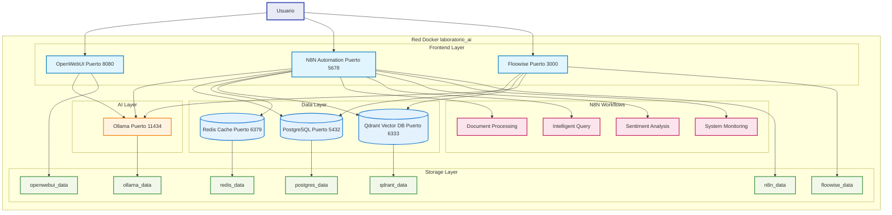
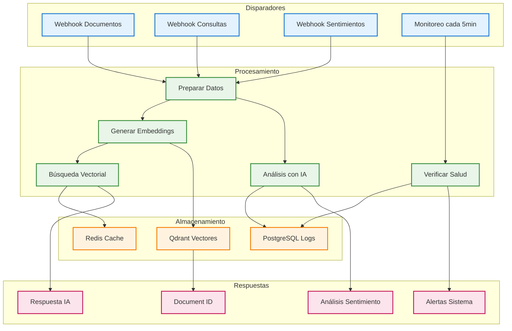
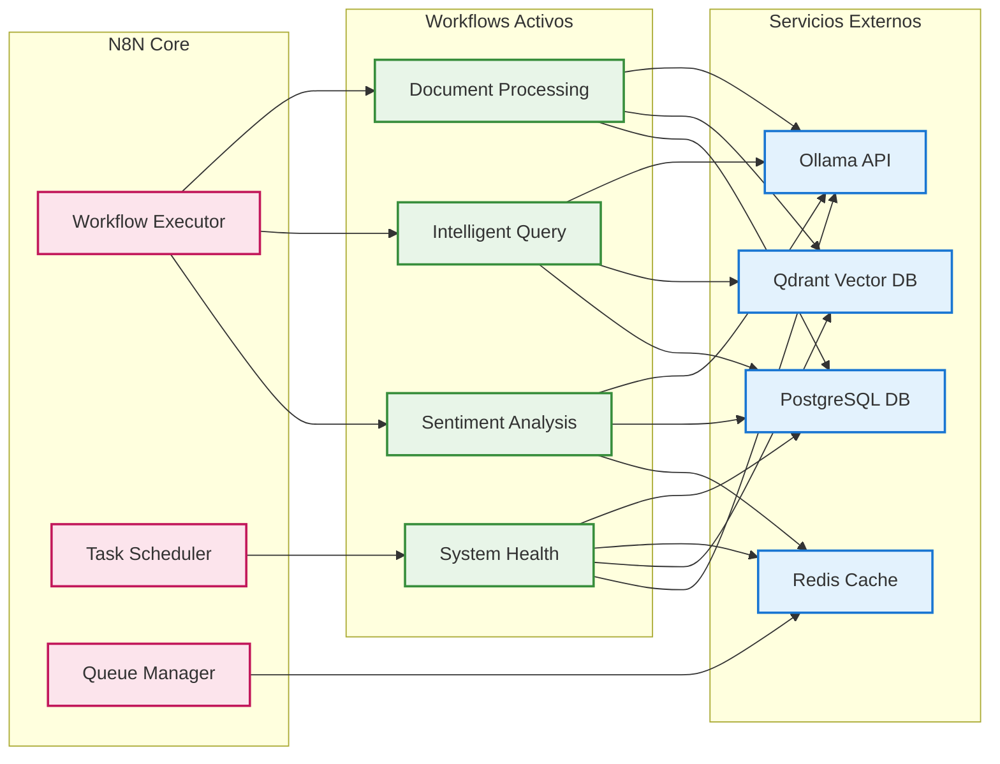
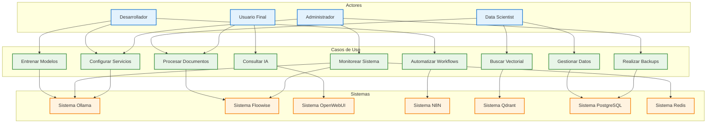
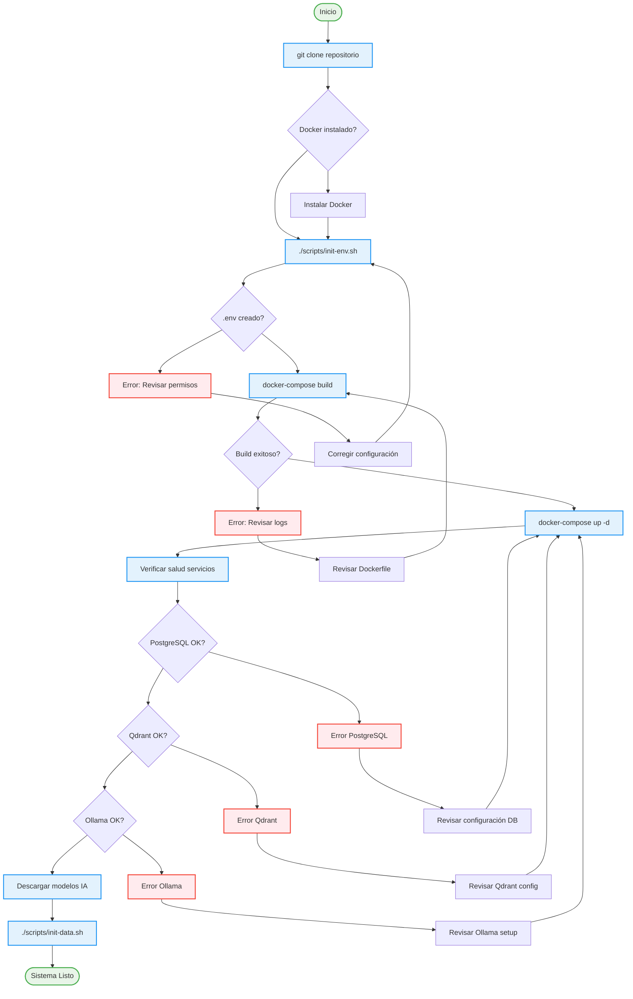
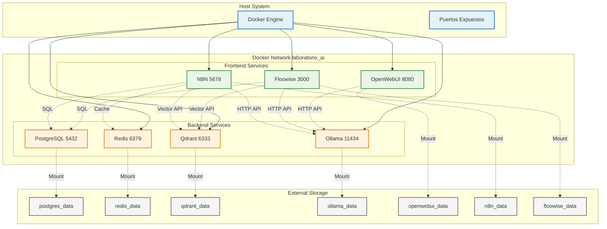

# Laboratorio AI Local

[](https://github.com/EdissonGirald0/laboratorioAI/actions/workflows/main.yml)
[](LICENSE)

## 🛠️ Tecnologías

[](https://www.docker.com/)
[](https://www.postgresql.org/)
[](https://redis.io/)
[](https://qdrant.tech/)
[](https://ollama.ai/)
[](https://n8n.io/)
[](https://flowiseai.com/)
[](https://nodejs.org/)
[](https://developer.mozilla.org/en-US/docs/Web/JavaScript)
[](https://sqlite.org/)
[](https://ubuntu.com/)
[](https://www.linux.org/)

## 📋 Información del Repositorio

Este repositorio contiene la configuración y scripts necesarios para desplegar un laboratorio de Inteligencia Artificial local utilizando Docker. El proyecto está diseñado para proporcionar un entorno completo y aislado para experimentar con diferentes modelos de IA y herramientas de procesamiento de datos.

## 🚀 Nuevas Funcionalidades v2.0 - Automatizaciones IA

### 🤖 Sistema Completo de Automatizaciones N8N
- **4 Workflows preconfigurados** para procesamiento automático de IA
- **Integración completa** con PostgreSQL, Redis, Qdrant y Ollama
- **APIs REST** listas para usar con endpoints especializados
- **Configuración automática** con scripts de instalación y pruebas

### ⚡ Cache y Performance con Redis
- **Sistema de colas** para tareas en background
- **Cache inteligente** para resultados de IA
- **Optimización de rendimiento** para consultas frecuentes
- **Persistencia configurable** con AOF

### 🧠 Procesamiento Inteligente de Documentos
- **Embeddings automáticos** con modelos Ollama
- **Almacenamiento vectorial** en Qdrant
- **Búsqueda semántica** avanzada
- **Metadatos estructurados** en PostgreSQL

### 😊 Análisis de Sentimientos y Emociones
- **Machine Learning** para análisis de texto
- **Detección de emociones** y tonos
- **Analytics detallados** con métricas
- **Soporte multiidioma**

### 🏥 Monitoreo y Alertas Automáticas
- **Verificación continua** de salud del sistema
- **Alertas inteligentes** por fallos o degradación
- **Dashboard en tiempo real** de métricas
- **Logs estructurados** para análisis

## 🏗️ Arquitectura del Sistema



## 📊 Diagrama de Secuencia - Flujo de Interacción


## 🔄 Flujo de Automatizaciones N8N



## 🔗 Integración de Servicios N8N



## 🎯 Casos de Uso del Sistema



## 🔧 Diagrama de Componentes


## 🔄 Flujo de Configuración e Inicialización



## 🌐 Diagrama de Red y Comunicación



### 🚀 Características Principales

- **Entorno Aislado**: Todos los servicios se ejecutan en contenedores Docker
- **Fácil Configuración**: Scripts automatizados para la configuración inicial
- **Backup Automático**: Sistema de respaldo para datos y configuraciones
- **Seguridad**: Configuración segura por defecto
- **Escalabilidad**: Fácil de extender con nuevos servicios

### 🛠️ Tecnologías Utilizadas

- Docker y Docker Compose
- PostgreSQL para almacenamiento de datos
- Qdrant para búsqueda vectorial
- Ollama para modelos de lenguaje local
- N8N para automatización
- Floowise para procesamiento de datos
- OpenWebUI para interfaz web

### 📦 Estructura del Repositorio

```
laboratorioAI/
├── .github/                    # Configuración de GitHub Actions
├── scripts/                    # Scripts de mantenimiento
├── postgres/                   # Configuración de PostgreSQL
├── qdrant/                     # Configuración de Qdrant
├── ollama/                     # Configuración de Ollama
├── n8n/                        # Configuración de N8N
├── floowise/                   # Configuración de Floowise
├── openwebui/                  # Configuración de OpenWebUI
├── docker-compose.yml          # Configuración de Docker Compose
├── .gitignore                  # Archivos ignorados por Git
├── LICENSE                     # Licencia del proyecto
└── README.md                   # Este archivo
```

## Requisitos Previos

- Docker y Docker Compose
- Git
- Sistema operativo Linux (recomendado Ubuntu 22.04 o superior)
- Mínimo 16GB de RAM
- 50GB de espacio en disco
- GPU compatible con CUDA (opcional, pero recomendado)

## Estructura del Proyecto

```
.
├── README.md                 # Documentación del proyecto
├── docker-compose.yml        # Configuración de servicios Docker
├── .gitignore               # Archivos ignorados por Git
├── LICENSE                  # Licencia del proyecto
├── scripts/                 # Scripts de mantenimiento y configuración
│   ├── init-env.sh         # Generación de variables de entorno
│   ├── init-data.sh        # Inicialización de bases de datos
│   ├── backup-data.sh      # Backup de datos y configuración
│   └── restore-data.sh     # Restauración desde backups
├── backups/                # Directorio de respaldos
├── postgres/              # Datos de PostgreSQL
│   └── data/
├── qdrant/               # Datos de Qdrant
│   └── data/
├── ollama/              # Datos de Ollama
│   └── data/
├── n8n/                 # Datos de n8n
│   └── data/
├── floowise/            # Datos de Floowise
│   └── data/
└── openwebui/           # Datos de OpenWebUI
    └── data/
```

## Configuración Inicial

**⚠️ IMPORTANTE**: Debes ejecutar estos pasos en orden:

1. Clonar el repositorio:
```bash
git clone <url-del-repositorio>
cd laboratorio-ai
```

2. **OBLIGATORIO** - Generar el archivo .env:
```bash
chmod +x scripts/init-env.sh
./scripts/init-env.sh
```

3. Iniciar los servicios:
```bash
docker-compose up -d
```

**Nota**: Si ejecutas `docker-compose up -d` sin haber creado el archivo `.env` primero, verás advertencias sobre variables no configuradas. En ese caso, ejecuta el paso 2 y luego reinicia los servicios:
```bash
docker-compose down
docker-compose up -d
```

## Scripts de Mantenimiento

### Inicialización del Entorno
```bash
./scripts/init-env.sh
```
- Genera claves de seguridad aleatorias
- Crea el archivo .env con todas las variables necesarias
- **Incluye configuración de Redis** con contraseña generada automáticamente
- Establece permisos correctos en el archivo .env
- Muestra las credenciales generadas (PostgreSQL, Redis, N8N, Qdrant, OpenWebUI)

### Inicialización de Bases de Datos
```bash
./scripts/init-data.sh
```
- Crea usuarios y roles en PostgreSQL
- Establece permisos necesarios
- Configura la base de datos inicial

### Backup de Datos
```bash
sudo ./scripts/backup-data.sh
```
- Realiza backup de todos los datos excepto Ollama
- Incluye archivos de configuración
- Mantiene los últimos 4 backups
- Genera archivo de metadatos
- Nota: Los modelos de Ollama se omiten del backup

### Restauración de Datos
```bash
sudo ./scripts/restore-data.sh ./backups/backup_YYYYMMDD_HHMMSS
```
- Restaura datos desde un backup específico
- Ajusta permisos automáticamente
- Reinicia los servicios
- Nota: Requiere descargar nuevamente los modelos de Ollama

## Servicios Disponibles

### Ollama (Modelos de IA)
- **URL**: http://localhost:11434
- **Versión**: 0.6.7
- **Configuración**: 
  - Host: 0.0.0.0
  - Puerto: 11434
  - Volumen persistente: ./ollama/data

### OpenWebUI (Interfaz Web para Ollama)
- **URL**: http://localhost:8080
- **Versión**: v0.6.13
- **Configuración**:
  - Base de datos: SQLite
  - Conexión a Ollama: http://host.docker.internal:11434/api
  - Volumen persistente: ./openwebui/data

### n8n (Automatización)
- **URL**: http://localhost:5678
- **Versión**: latest (1.97.1)
- **Configuración**:
  - Modo: development
  - Gestión de usuarios: deshabilitada
  - Diagnósticos: deshabilitados
  - Métricas: deshabilitadas
  - Archivos de configuración: deshabilitados

### Floowise (Aplicación Principal)
- **URL**: http://localhost:3000
- **Configuración**:
  - Base de datos: PostgreSQL
  - Vector DB: Qdrant
  - Volumen persistente: ./floowise/data

### PostgreSQL (Base de Datos)
- **Puerto**: 5432
- **Versión**: 16
- **Configuración**:
  - Usuario root: definido en .env
  - Usuario no root: definido en .env
  - Volumen persistente: ./postgres/data

### Qdrant (Base de Datos Vectorial)
- **URL**: http://localhost:6333
- **Versión**: latest
- **Configuración**:
  - Puerto: 6333
  - API Key: generada automáticamente
  - Volumen persistente: ./qdrant/data

### Redis (Cache y Sistema de Colas)
- **Puerto**: 6379
- **Versión**: 7-alpine
- **Configuración**:
  - Persistencia: AOF habilitada
  - Contraseña: generada automáticamente en .env
  - Volumen persistente: ./redis/data
  - Usado por N8N para manejo de colas y cache

## 🤖 Automatizaciones N8N

### Configuración Automática
El laboratorio incluye un sistema completo de automatizaciones N8N preconfiguradas:

```bash
# Configurar automatizaciones N8N
./scripts/setup-n8n-automation.sh

# Probar todas las automatizaciones
./scripts/test-n8n-automations.sh
```

### Workflows Disponibles

#### 1. 📄 Procesamiento de Documentos
- **Endpoint**: `POST http://localhost:5678/webhook/document-processing`
- **Funcionalidad**: 
  - Recibe documentos vía webhook
  - Genera embeddings con Ollama
  - Almacena vectores en Qdrant
  - Guarda metadatos en PostgreSQL
- **Payload de ejemplo**:
```json
{
  "content": "Texto del documento",
  "filename": "documento.txt",
  "content_type": "text/plain",
  "metadata": {
    "author": "Usuario",
    "category": "documentos"
  }
}
```

#### 2. 🧠 Sistema de Consultas Inteligentes
- **Endpoint**: `POST http://localhost:5678/webhook/intelligent-query`
- **Funcionalidad**:
  - Procesa consultas en lenguaje natural
  - Busca información relevante en Qdrant
  - Genera respuestas contextuales con IA
  - Registra todas las consultas
- **Payload de ejemplo**:
```json
{
  "query": "¿Qué información tienes sobre machine learning?",
  "limit": 5,
  "threshold": 0.7
}
```

#### 3. 😊 Análisis de Sentimientos
- **Endpoint**: `POST http://localhost:5678/webhook/sentiment-analysis`
- **Funcionalidad**:
  - Analiza sentimientos en texto
  - Identifica emociones y tonos
  - Cache de resultados en Redis
  - Analytics y métricas detalladas
- **Payload de ejemplo**:
```json
{
  "text": "Me encanta este laboratorio de IA!",
  "language": "es",
  "source": "usuario",
  "user_id": "usuario123"
}
```

#### 4. 🏥 Monitoreo del Sistema
- **Funcionalidad**:
  - Verificación automática cada 5 minutos
  - Monitoreo de salud de todos los servicios
  - Alertas automáticas por fallos
  - Dashboard de métricas en tiempo real
- **Servicios monitoreados**:
  - PostgreSQL
  - Redis
  - Qdrant
  - Ollama
  - OpenWebUI

### Integraciones de Base de Datos

#### PostgreSQL
Las automatizaciones crean y utilizan las siguientes tablas:

```sql
-- Logs de consultas inteligentes
CREATE TABLE query_logs (
    query_id VARCHAR(255) PRIMARY KEY,
    original_query TEXT,
    documents_found INTEGER,
    response_generated TEXT,
    timestamp TIMESTAMP
);

-- Análisis de sentimientos
CREATE TABLE sentiment_analysis (
    analysis_id VARCHAR(255) PRIMARY KEY,
    original_text TEXT,
    overall_sentiment VARCHAR(20),
    confidence_score DECIMAL(5,3),
    emotional_indicators JSONB,
    created_at TIMESTAMP
);

-- Documentos procesados
CREATE TABLE processed_documents (
    document_id VARCHAR(255) PRIMARY KEY,
    filename VARCHAR(255),
    content_type VARCHAR(100),
    qdrant_point_id VARCHAR(255),
    processed_at TIMESTAMP
);

-- Logs de salud del sistema
CREATE TABLE system_health_logs (
    check_id VARCHAR(255) PRIMARY KEY,
    overall_health VARCHAR(20),
    service_details JSONB,
    timestamp TIMESTAMP
);
```

#### Redis Cache
Redis se utiliza para:
- **Sistema de colas N8N**: Manejo de tareas en background
- **Cache de sentimientos**: Resultados de análisis con TTL de 1 hora
- **Estado del sistema**: Última verificación de salud (TTL 10 minutos)
- **Métricas en tiempo real**: Contadores y estadísticas

### APIs de Automatización

#### Verificar Estado de Automatizaciones
```bash
# Ver workflows activos
curl http://localhost:5678/api/v1/workflows

# Ver ejecuciones recientes
curl http://localhost:5678/api/v1/executions

# Ver estado de salud del sistema
redis-cli -p 6379 -a <REDIS_PASSWORD> GET system:health:latest
```

#### Ejemplos de Uso

##### Procesar un documento
```bash
curl -X POST http://localhost:5678/webhook/document-processing \
  -H "Content-Type: application/json" \
  -d '{
    "content": "Machine Learning es una rama de la inteligencia artificial...",
    "filename": "ml-intro.txt",
    "content_type": "text/plain"
  }'
```

##### Hacer una consulta inteligente
```bash
curl -X POST http://localhost:5678/webhook/intelligent-query \
  -H "Content-Type: application/json" \
  -d '{
    "query": "Explícame qué es Machine Learning",
    "limit": 3
  }'
```

##### Analizar sentimiento
```bash
curl -X POST http://localhost:5678/webhook/sentiment-analysis \
  -H "Content-Type: application/json" \
  -d '{
    "text": "Este laboratorio es increíble, me encanta trabajar con IA!",
    "language": "es"
  }'
```

### Métricas y Monitoreo

#### Dashboard de Salud
Accede a métricas en tiempo real:
- **N8N Dashboard**: http://localhost:5678
- **PostgreSQL**: Consultas a las tablas de logs
- **Redis**: Comandos INFO y MONITOR
- **Sistema**: Logs automáticos cada 5 minutos

#### Alertas Automáticas
El sistema genera alertas automáticas cuando:
- Servicios están inactivos
- Errores en procesamiento
- Rendimiento degradado
- Fallos de conectividad

## Gestión de Datos

### Volúmenes Persistentes
Todos los datos se almacenan en volúmenes locales:
- **PostgreSQL**: ./postgres/data
- **Redis**: ./redis/data
- **Qdrant**: ./qdrant/data
- **Ollama**: ./ollama/data
- **N8N**: ./n8n/data (incluye workflows y credenciales)
- **Floowise**: ./floowise/data
- **OpenWebUI**: ./openwebui/data

### Directorios de Configuración
- **N8N Workflows**: ./n8n/workflows/ (automatizaciones preconfiguradas)
- **N8N Credentials**: ./n8n/credentials/ (credenciales de servicios)
- **PostgreSQL Scripts**: ./postgres/init-scripts/ (esquemas de BD)
- **Scripts de Automatización**: ./scripts/ (configuración y pruebas)

### Reinicio de Servicios
Para reiniciar todos los servicios:
```bash
docker-compose down && docker-compose up -d
```

Para reiniciar un servicio específico:
```bash
docker-compose restart <nombre-servicio>
```

## Solución de Problemas

### Problemas de Conexión
Si hay problemas de conexión entre servicios:
1. Verificar que todos los contenedores estén en ejecución:
```bash
docker-compose ps
```

2. Verificar los logs de un servicio específico:
```bash
docker-compose logs <nombre-servicio>
```

3. Verificar conectividad de red:
```bash
docker network inspect laboratorio_ai
```

### Problemas con N8N
- Si hay problemas con la clave de encriptación, verificar que N8N_ENCRYPTION_KEY esté correctamente configurada en .env
- Para reiniciar workflows: `docker-compose restart n8n`
- Verificar logs de N8N: `docker-compose logs n8n`
- Verificar conexiones a PostgreSQL y Redis en las credenciales

### Problemas con Redis
- Verificar conexión: `docker exec laboratorioai-redis-1 redis-cli -a <REDIS_PASSWORD> ping`
- Ver uso de memoria: `docker exec laboratorioai-redis-1 redis-cli -a <REDIS_PASSWORD> info memory`
- Limpiar cache: `docker exec laboratorioai-redis-1 redis-cli -a <REDIS_PASSWORD> flushall`

### Problemas con Automatizaciones
- Ejecutar script de pruebas: `./scripts/test-n8n-automations.sh`
- Verificar logs de workflows en N8N dashboard
- Reiniciar configuración: `./scripts/setup-n8n-automation.sh`
- Verificar estado de servicios: `curl http://localhost:5678/healthz`

### Problemas de Base de Datos
- Verificar conexión PostgreSQL: `docker exec laboratorioai-postgres-1 pg_isready`
- Ver logs de PostgreSQL: `docker-compose logs postgres`
- Recrear esquemas: ejecutar scripts en ./postgres/init-scripts/

### Diagnóstico del Sistema
Ejecutar diagnóstico completo:
```bash
# Script de pruebas integral
./scripts/test-n8n-automations.sh

# Verificar todos los servicios
./scripts/validate-env.sh

# Ver estado de salud
curl -s http://localhost:5678/webhook/system-health | jq
```

## Notas de Actualización

### Cambios Recientes v2.0 (Automatizaciones IA)
- ✅ **Redis agregado**: Sistema de cache y colas para N8N
- ✅ **4 Workflows N8N preconfigurados**:
  - Procesamiento automático de documentos con IA
  - Sistema de consultas inteligentes con búsqueda vectorial
  - Análisis de sentimientos con machine learning
  - Monitoreo automático del sistema cada 5 minutos
- ✅ **Base de datos expandida**: Nuevas tablas para logs, sentimientos y monitoreo
- ✅ **Scripts de automatización**: Configuración y pruebas automáticas
- ✅ **Credenciales preconfiguradas**: PostgreSQL y Redis para N8N
- ✅ **APIs REST**: Endpoints para todas las funcionalidades IA
- ✅ **Sistema de alertas**: Notificaciones automáticas por fallos
- ✅ **Cache inteligente**: Redis para optimización de rendimiento
- ✅ **Documentación completa**: Ejemplos de uso y troubleshooting

### Cambios Previos v1.0
- Movidos scripts de inicialización a la carpeta scripts/
- Mejorado el sistema de backup y restauración
- Agregado soporte para modelos Ollama personalizados
- Configuración de red Docker optimizada

### Próximas Funcionalidades
- 🔄 Dashboard web personalizado para métricas
- 🔄 Integración con modelos de Hugging Face
- 🔄 Sistema de notificaciones por email/Slack
- 🔄 API GraphQL para consultas avanzadas
- 🔄 Clustering automático de documentos
- 🔄 Sistema de backup automático programado
- Omitidos los datos de Ollama del backup
- Agregada generación automática de API Key para Qdrant
- Optimizada la gestión de permisos en los scripts

### 🤝 Contribuciones

Las contribuciones son bienvenidas. Por favor, lee nuestras guías de contribución antes de enviar un pull request:

1. Haz fork del repositorio
2. Crea una rama para tu feature (`git checkout -b feature/AmazingFeature`)
3. Haz commit de tus cambios (`git commit -m 'Add some AmazingFeature'`)
4. Push a la rama (`git push origin feature/AmazingFeature`)
5. Abre un Pull Request

### 📝 Licencia

Este proyecto está bajo la Licencia MIT - ver el archivo [LICENSE](LICENSE) para más detalles.

### 👥 Autores

- **Edisson Giraldo** - *Desarrollo inicial* - [EdissonGirald0](https://github.com/EdissonGirald0)
