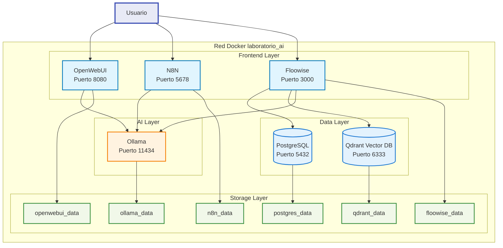
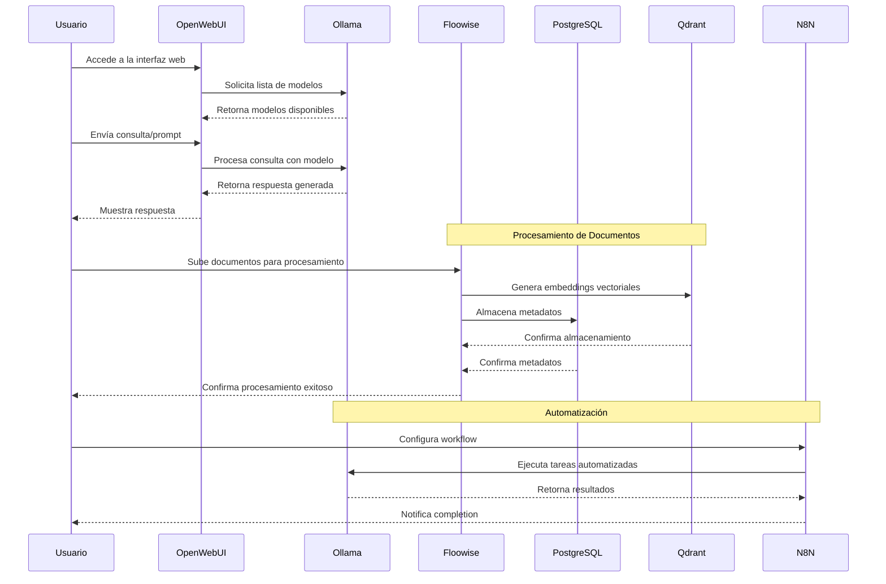
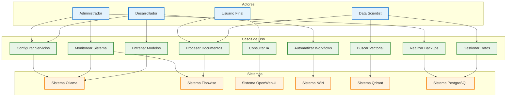
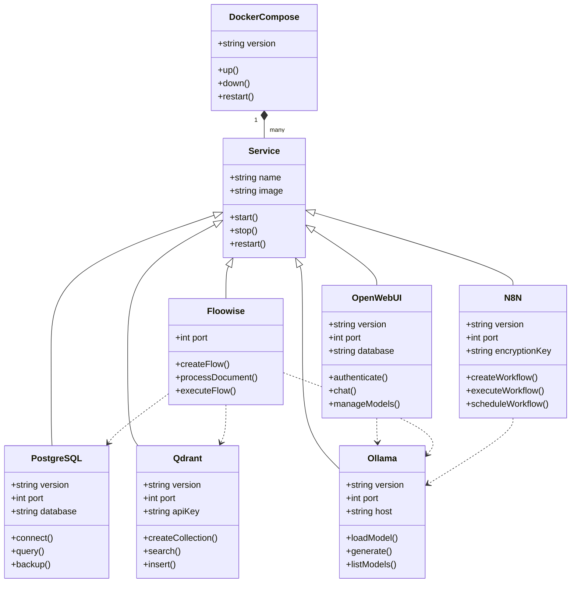
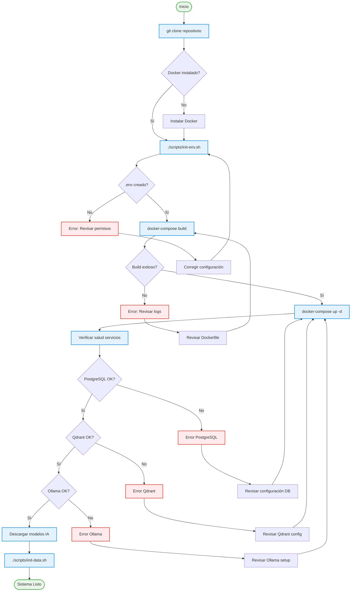
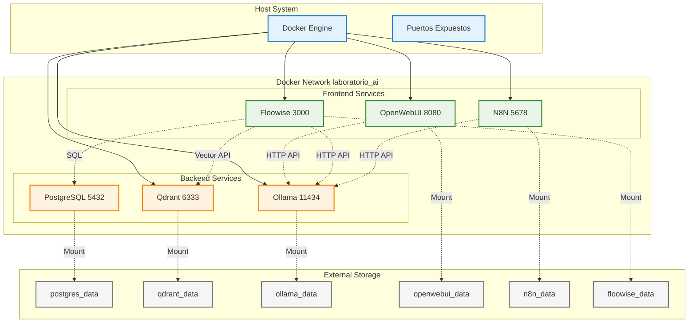

# Laboratorio AI Local

[](https://github.com/EdissonGirald0/laboratorioAI/actions/workflows/main.yml)
[](LICENSE)

## 🛠️ Tecnologías

[](https://www.docker.com/)
[](https://www.postgresql.org/)
[](https://qdrant.tech/)
[](https://ollama.ai/)
[](https://n8n.io/)
[](https://nodejs.org/)
[](https://developer.mozilla.org/en-US/docs/Web/JavaScript)
[](https://sqlite.org/)
[](https://ubuntu.com/)
[](https://www.linux.org/)

## 📋 Información del Repositorio

Este repositorio contiene la configuración y scripts necesarios para desplegar un laboratorio de Inteligencia Artificial local utilizando Docker. El proyecto está diseñado para proporcionar un entorno completo y aislado para experimentar con diferentes modelos de IA y herramientas de procesamiento de datos.

## 🏗️ Arquitectura del Sistema



## 📊 Diagrama de Secuencia - Flujo de Interacción



## 🎯 Casos de Uso del Sistema



## 🔧 Diagrama de Componentes



## 🔄 Flujo de Configuración e Inicialización



## 🌐 Diagrama de Red y Comunicación



### 🚀 Características Principales

- **Entorno Aislado**: Todos los servicios se ejecutan en contenedores Docker
- **Fácil Configuración**: Scripts automatizados para la configuración inicial
- **Backup Automático**: Sistema de respaldo para datos y configuraciones
- **Seguridad**: Configuración segura por defecto
- **Escalabilidad**: Fácil de extender con nuevos servicios

### 🛠️ Tecnologías Utilizadas

- Docker y Docker Compose
- PostgreSQL para almacenamiento de datos
- Qdrant para búsqueda vectorial
- Ollama para modelos de lenguaje local
- N8N para automatización
- Floowise para procesamiento de datos
- OpenWebUI para interfaz web

### 📦 Estructura del Repositorio

```
laboratorioAI/
├── .github/                    # Configuración de GitHub Actions
├── scripts/                    # Scripts de mantenimiento
├── postgres/                   # Configuración de PostgreSQL
├── qdrant/                     # Configuración de Qdrant
├── ollama/                     # Configuración de Ollama
├── n8n/                        # Configuración de N8N
├── floowise/                   # Configuración de Floowise
├── openwebui/                  # Configuración de OpenWebUI
├── docker-compose.yml          # Configuración de Docker Compose
├── .gitignore                  # Archivos ignorados por Git
├── LICENSE                     # Licencia del proyecto
└── README.md                   # Este archivo
```

## Requisitos Previos

- Docker y Docker Compose
- Git
- Sistema operativo Linux (recomendado Ubuntu 22.04 o superior)
- Mínimo 16GB de RAM
- 50GB de espacio en disco
- GPU compatible con CUDA (opcional, pero recomendado)

## Estructura del Proyecto

```
.
├── README.md                 # Documentación del proyecto
├── docker-compose.yml        # Configuración de servicios Docker
├── .gitignore               # Archivos ignorados por Git
├── LICENSE                  # Licencia del proyecto
├── scripts/                 # Scripts de mantenimiento y configuración
│   ├── init-env.sh         # Generación de variables de entorno
│   ├── init-data.sh        # Inicialización de bases de datos
│   ├── backup-data.sh      # Backup de datos y configuración
│   └── restore-data.sh     # Restauración desde backups
├── backups/                # Directorio de respaldos
├── postgres/              # Datos de PostgreSQL
│   └── data/
├── qdrant/               # Datos de Qdrant
│   └── data/
├── ollama/              # Datos de Ollama
│   └── data/
├── n8n/                 # Datos de n8n
│   └── data/
├── floowise/            # Datos de Floowise
│   └── data/
└── openwebui/           # Datos de OpenWebUI
    └── data/
```

## Configuración Inicial

1. Clonar el repositorio:
```bash
git clone <url-del-repositorio>
cd laboratorio-ai
```

2. Generar el archivo .env:
```bash
chmod +x scripts/init-env.sh
./scripts/init-env.sh
```

3. Iniciar los servicios:
```bash
docker-compose up -d
```

## Scripts de Mantenimiento

### Inicialización del Entorno
```bash
./scripts/init-env.sh
```
- Genera claves de seguridad aleatorias
- Crea el archivo .env con todas las variables necesarias
- Establece permisos correctos en el archivo .env
- Muestra las credenciales generadas

### Inicialización de Bases de Datos
```bash
./scripts/init-data.sh
```
- Crea usuarios y roles en PostgreSQL
- Establece permisos necesarios
- Configura la base de datos inicial

### Backup de Datos
```bash
sudo ./scripts/backup-data.sh
```
- Realiza backup de todos los datos excepto Ollama
- Incluye archivos de configuración
- Mantiene los últimos 4 backups
- Genera archivo de metadatos
- Nota: Los modelos de Ollama se omiten del backup

### Restauración de Datos
```bash
sudo ./scripts/restore-data.sh ./backups/backup_YYYYMMDD_HHMMSS
```
- Restaura datos desde un backup específico
- Ajusta permisos automáticamente
- Reinicia los servicios
- Nota: Requiere descargar nuevamente los modelos de Ollama

## Servicios Disponibles

### Ollama (Modelos de IA)
- **URL**: http://localhost:11434
- **Versión**: 0.6.7
- **Configuración**: 
  - Host: 0.0.0.0
  - Puerto: 11434
  - Volumen persistente: ./ollama/data

### OpenWebUI (Interfaz Web para Ollama)
- **URL**: http://localhost:8080
- **Versión**: v0.6.13
- **Configuración**:
  - Base de datos: SQLite
  - Conexión a Ollama: http://host.docker.internal:11434/api
  - Volumen persistente: ./openwebui/data

### n8n (Automatización)
- **URL**: http://localhost:5678
- **Versión**: latest (1.97.1)
- **Configuración**:
  - Modo: development
  - Gestión de usuarios: deshabilitada
  - Diagnósticos: deshabilitados
  - Métricas: deshabilitadas
  - Archivos de configuración: deshabilitados

### Floowise (Aplicación Principal)
- **URL**: http://localhost:3000
- **Configuración**:
  - Base de datos: PostgreSQL
  - Vector DB: Qdrant
  - Volumen persistente: ./floowise/data

### PostgreSQL (Base de Datos)
- **Puerto**: 5432
- **Versión**: 16
- **Configuración**:
  - Usuario root: definido en .env
  - Usuario no root: definido en .env
  - Volumen persistente: ./postgres/data

### Qdrant (Base de Datos Vectorial)
- **URL**: http://localhost:6333
- **Versión**: latest
- **Configuración**:
  - Puerto: 6333
  - API Key: generada automáticamente
  - Volumen persistente: ./qdrant/data

## Gestión de Datos

### Volúmenes Persistentes
Todos los datos se almacenan en volúmenes locales:
- PostgreSQL: ./postgres/data
- Qdrant: ./qdrant/data
- Ollama: ./ollama/data
- n8n: ./n8n/data
- Floowise: ./floowise/data
- OpenWebUI: ./openwebui/data

### Reinicio de Servicios
Para reiniciar todos los servicios:
```bash
docker-compose down && docker-compose up -d
```

Para reiniciar un servicio específico:
```bash
docker-compose restart <nombre-servicio>
```

## Solución de Problemas

### Problemas de Conexión
Si hay problemas de conexión entre servicios:
1. Verificar que todos los contenedores estén en ejecución:
```bash
docker-compose ps
```

2. Verificar los logs de un servicio específico:
```bash
docker-compose logs <nombre-servicio>
```

### Problemas con n8n
- Si hay problemas con la clave de encriptación, verificar que N8N_ENCRYPTION_KEY esté correctamente configurada en .env
- Los task runners están deshabilitados por defecto, pero se recomienda habilitarlos en futuras versiones

## Notas de Actualización

### Cambios Recientes
- Movidos scripts de inicialización a la carpeta scripts/
- Mejorado el sistema de backup y restauración
- Omitidos los datos de Ollama del backup
- Agregada generación automática de API Key para Qdrant
- Optimizada la gestión de permisos en los scripts

### 🤝 Contribuciones

Las contribuciones son bienvenidas. Por favor, lee nuestras guías de contribución antes de enviar un pull request:

1. Haz fork del repositorio
2. Crea una rama para tu feature (`git checkout -b feature/AmazingFeature`)
3. Haz commit de tus cambios (`git commit -m 'Add some AmazingFeature'`)
4. Push a la rama (`git push origin feature/AmazingFeature`)
5. Abre un Pull Request

### 📝 Licencia

Este proyecto está bajo la Licencia MIT - ver el archivo [LICENSE](LICENSE) para más detalles.

### 👥 Autores

- **Edisson Giraldo** - *Desarrollo inicial* - [EdissonGirald0](https://github.com/EdissonGirald0)
