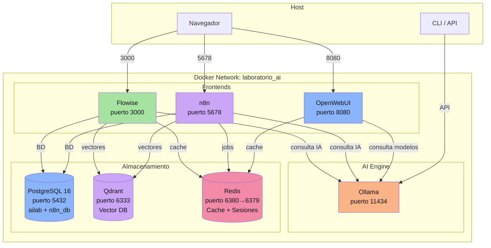
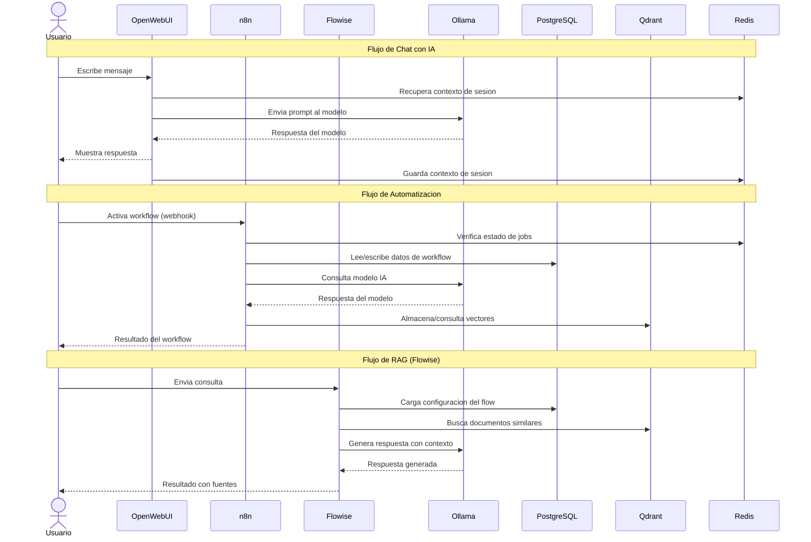
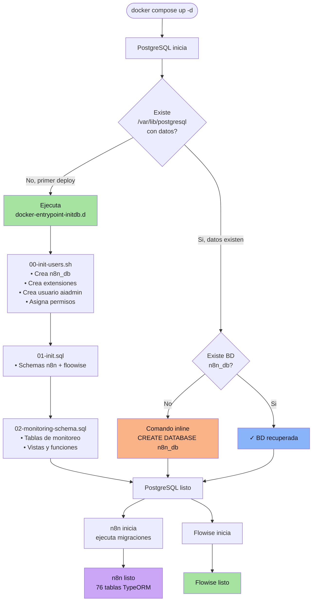
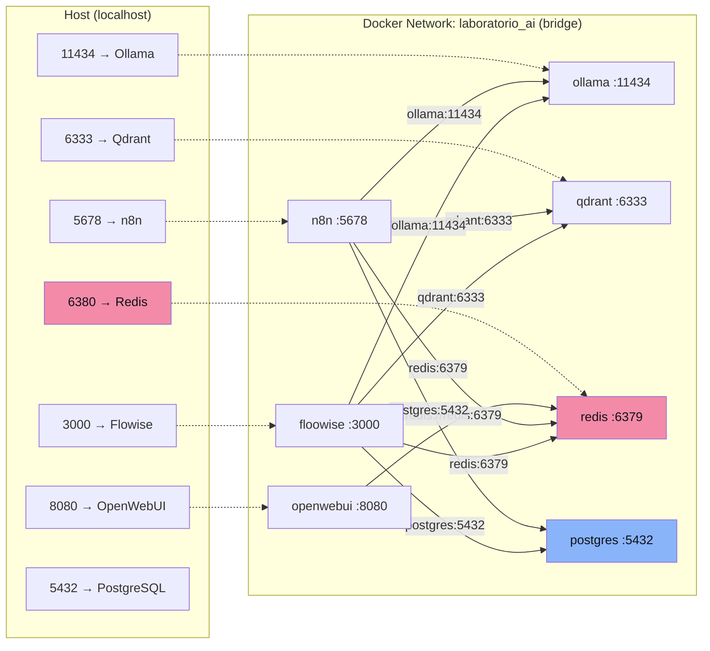
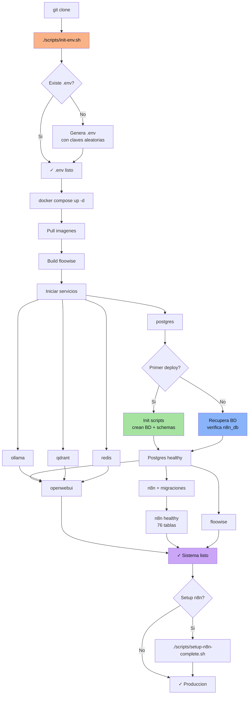
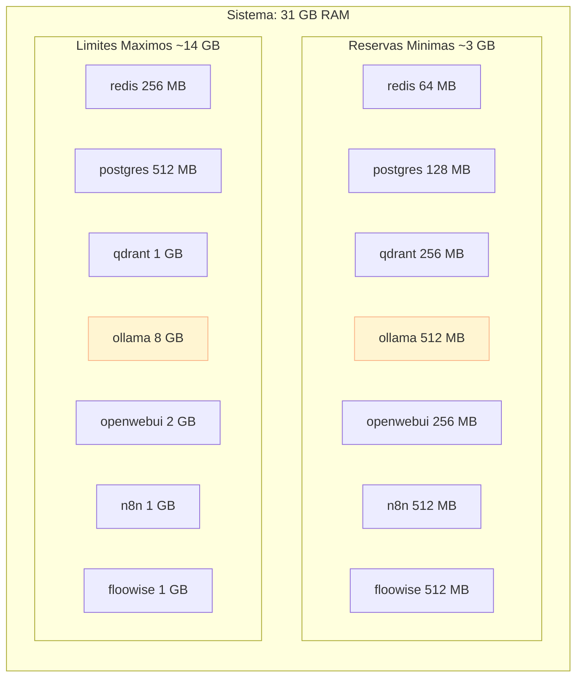
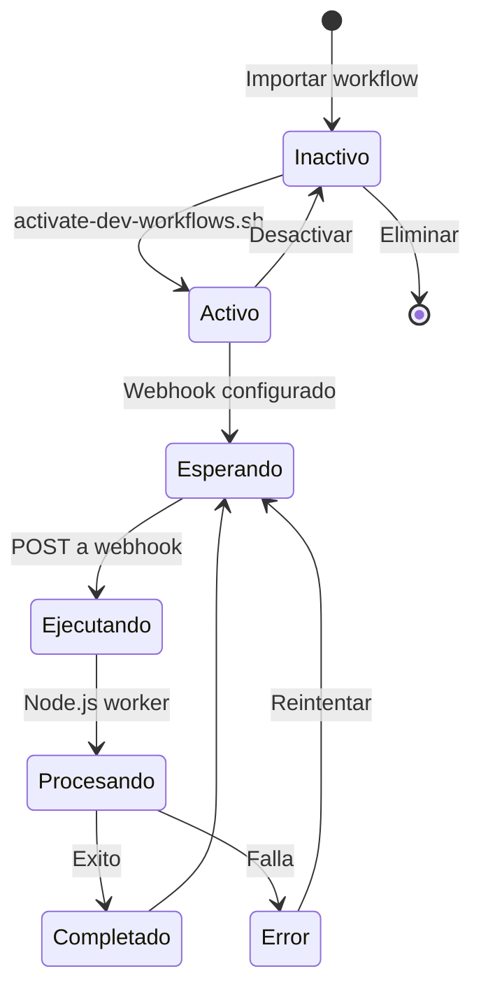

# Arquitectura del Sistema

## 1. Arquitectura de Servicios



## 2. Flujo de Datos



## 3. Estructura de Bases de Datos

```mermaid
erDiagram
    POSTGRESQL {
        string ailab "Flowise DB"
        string n8n_db "n8n DB"
    }

    ailab ||--o{ system_health_logs : contiene
    ailab ||--o{ system_alerts : contiene
    ailab ||--o{ performance_metrics : contiene

    system_health_logs {
        int id PK
        string check_id UK
        string overall_health
        int healthy_services
        int total_services
        jsonb service_details
        timestamp timestamp
    }

    system_alerts {
        int id PK
        string alert_id UK
        string severity
        string title
        text message
        jsonb details
        string status
        timestamp created_at
    }

    performance_metrics {
        int id PK
        string metric_id UK
        string service_name
        string metric_type
        decimal metric_value
        timestamp timestamp
    }

    n8n_db {
        string "76 tablas (TypeORM)"
    }

    QDRANT {
        string collections "Colecciones vectoriales"
    }

    REDIS {
        string sessions "Sesiones OpenWebUI"
        string cache "Cache Flowise"
        string jobs "Jobs n8n"
        string bull "Bull Queue"
    }
```

## 4. Inicializacion y Recuperacion de BD



## 5. Red y Puertos



## 6. Flujo de Despliegue



## 7. Recursos y Limites



## 8. Ciclo de Vida de un Workflow n8n

