# Workflows n8n del LaboratorioAI

## Modelo configurado

Todos los workflows usan **Ollama** con el modelo **`gemma4:latest`** corriendo localmente en `http://ollama:11434`.

## Diagrama General

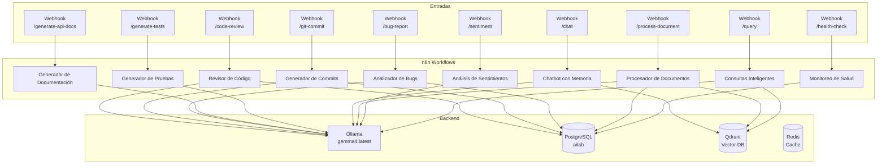

---

## 1. Chatbot con Memoria

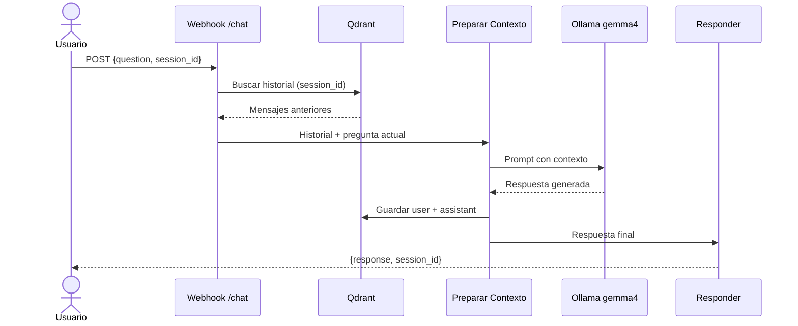

**Webhook:** `POST http://localhost:5678/webhook/chat`
```json
{ "question": "¿Qué es Docker?", "session_id": "user-123" }
```

---

## 2. Asistente de Revisión de Código

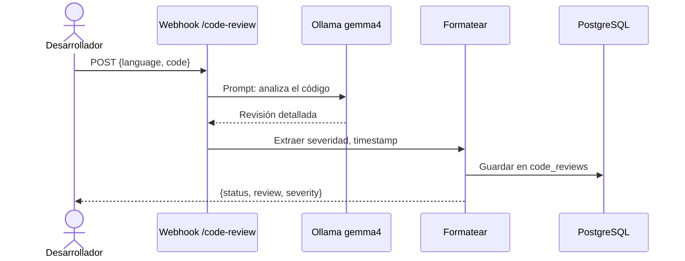

**Webhook:** `POST http://localhost:5678/webhook/code-review`
```json
{ "language": "python", "code": "def hello():\n    print('world')" }
```

---

## 3. Generador de Mensajes de Commit

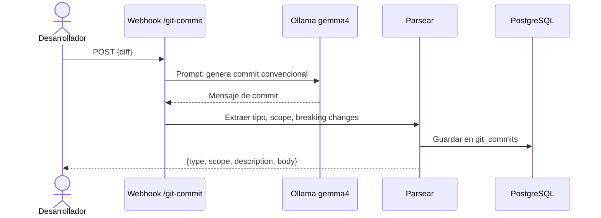

**Webhook:** `POST http://localhost:5678/webhook/git-commit`
```json
{ "diff": "--- a/main.py\n+++ b/main.py\n@@ -1 +1 @@\n-print('hello')\n+print('hola')" }
```

---

## 4. Analizador de Reportes de Bug

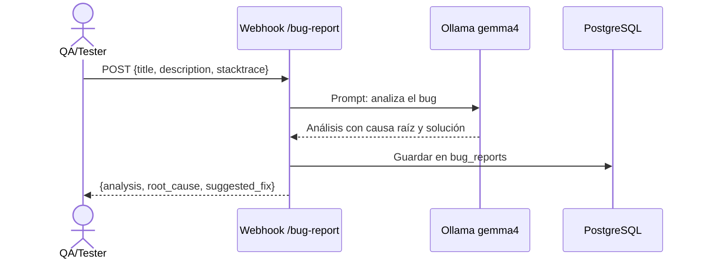

**Webhook:** `POST http://localhost:5678/webhook/bug-report`

---

## 5. Generador de Documentación API

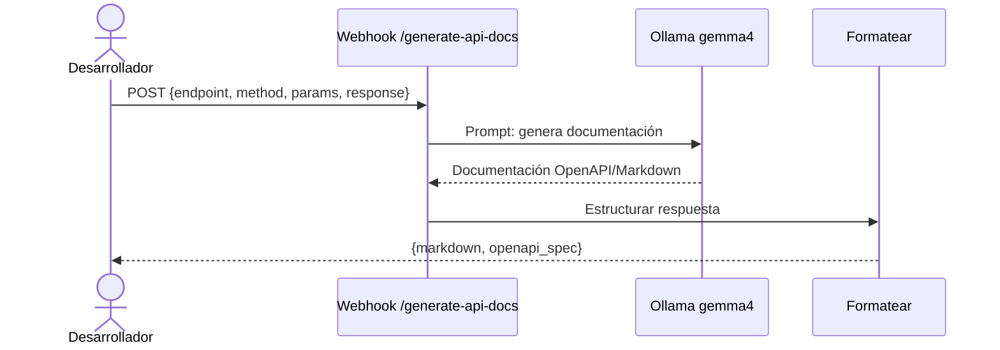

**Webhook:** `POST http://localhost:5678/webhook/generate-api-docs`

---

## 6. Generador de Casos de Prueba

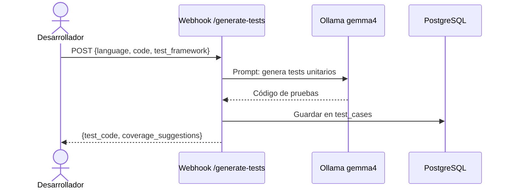

**Webhook:** `POST http://localhost:5678/webhook/generate-tests`

---

## 7. Procesamiento de Documentos

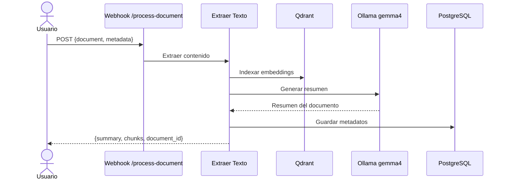

**Webhook:** `POST http://localhost:5678/webhook/process-document`

---

## 8. Análisis de Sentimientos

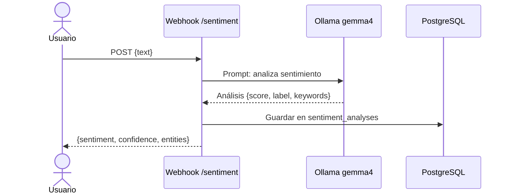

**Webhook:** `POST http://localhost:5678/webhook/sentiment`

---

## 9. Sistema de Consultas Inteligentes

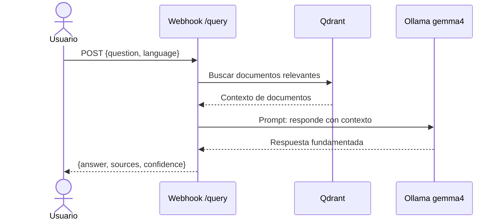

**Webhook:** `POST http://localhost:5678/webhook/query`

---

## 10. Monitoreo de Salud del Sistema

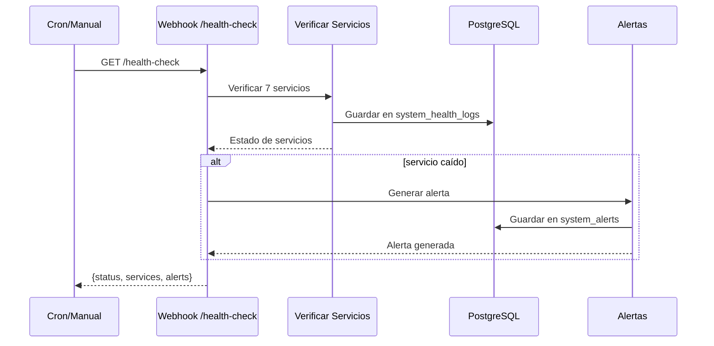

**Webhook:** `GET http://localhost:5678/webhook/health-check`

---

## Activar workflows

```bash
# Activar todos los workflows de desarrollo
./scripts/activate-dev-workflows.sh

# O activar uno por uno desde la UI de n8n
```

## Probar workflows

```bash
# Code Review
curl -X POST http://localhost:5678/webhook/code-review \
  -H "Content-Type: application/json" \
  -d '{"language":"python","code":"def suma(a,b): return a+b"}'

# Git Commit  
curl -X POST http://localhost:5678/webhook/git-commit \
  -H "Content-Type: application/json" \
  -d '{"diff":"---\n+++\n@@ -1 +1 @@\n-old\n+new"}'

# Chat
curl -X POST http://localhost:5678/webhook/chat \
  -H "Content-Type: application/json" \
  -d '{"question":"¿Qué es un contenedor Docker?","session_id":"test-1"}'
```
